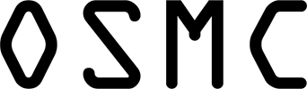
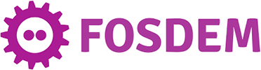

## Past **Events**

[owl-carousel items=3 margin=30 loop=true autoplay=true autoplayTimeout=750]

[/owl-carousel]

19. <b><a href="https://www.wuerth-phoenix.com/neteye-insights/neteye-user-group-it-2022">Würth Phoenix User Group</a> 2022</b>  November 9, Verona, Italy 
18. <b><a href="https://www.wuerth-phoenix.com/en/neteye-insights/neteye-user-group-it-2021/page">Würth Phoenix User Group</a> Virtual, 2021</b> 
17. <b><a href="https://www.wuerth-phoenix.com/en/support/neteye-user-group/page">Würth Phoenix User Group</a> Virtual, 2020</b> 
16. <b><a href="https://www.wuerth-phoenix.com/fileadmin/user_upload/downloads/2019_NetEye_UserGroup.pdf">Würth Phoenix User Group</a> Italy 2019</b>  November, Museo Ferrari (MO), Italy 
15. <b><a href="https://www.wuerth-phoenix.com/it/lazienda/about-wuerth-phoenix/news/details/neteye-erizone-user-group-2019-germania">Würth Phoenix User Group</a> Dauphin Speed Event 2019</b>  April, Germany 
14. <b><a href="https://www.sfscon.it/">SFScon</a> 2019</b>  November 15, Bolzano, Italy 
13. <b><a href="https://icinga.com/events/">Icinga Camp</a> Milan 2019</b>  September 26, Milan, Italy 
12. <b><a href="https://icinga.com/events/">Icinga Camp</a> Berlin 2019</b>  March 14, Berlin, Germany 
11. <b><a href="https://www.sfscon.it/">SFScon</a> 2018</b>  November 16, Bolzano, Italy 
10. <b><a href="https://osmc.de/">OSMC</a> 2018</b>  November 5, Nuremberg, Germany 
9. <b><a href="https://www.wuerth-phoenix.com/">Würth Phoenix UserGroup</a> Italy 2018</b>  October 18, Cavaion Veronese (VR), Italy 
8. <b><a href="https://www.wuerth-phoenix.com/">Würth Phoenix UserGroup</a> Germany 2017</b>  March 23, Nuremberg, Germany 
7. <b><a href="https://icinga.com/events/">Icinga Camp</a> Berlin 2017</b>  March 7, Berlin, Germany 
6. <b><a href="https://fosdem.org/">FOSDEM</a> 2017</b>  February 4, Brussels, Belgium 
5. <b><a href="https://www.sfscon.it/">SFScon</a> 2016</b>  November 11, Bolzano, Italy 
4. <b><a href="https://www.wuerth-phoenix.com/">Würth Phoenix UserGroup</a> Italy 2016</b>  October 20, Trento, Italy 
3. <b><a href="https://icinga.com/events/">Icinga Camp</a> Stockholm 2016</b>  October 11, Stockholm, Sweden 
2. <b><a href="https://www.wuerth-phoenix.com/">Würth Phoenix UserGroup</a> Germany 2016</b>  May 12, Ludwigsburg, Germany 
1. <b><a href="https://osmc.de/">OSMC</a> 2015</b>  November 16, Nuremberg, Germany 
