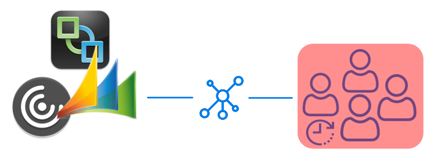
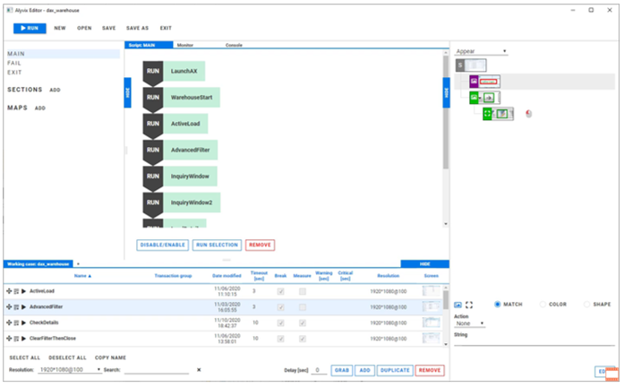
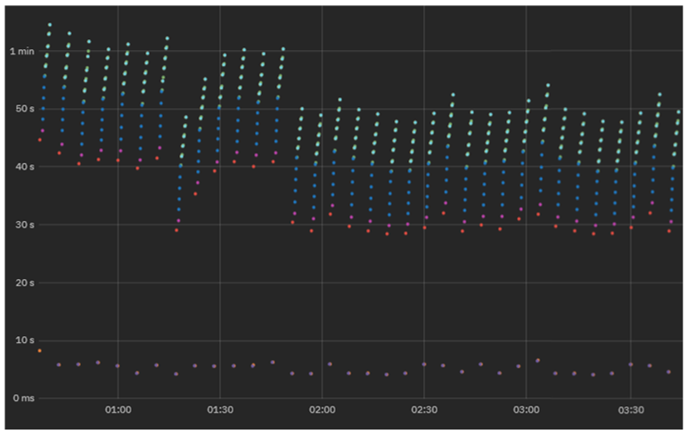
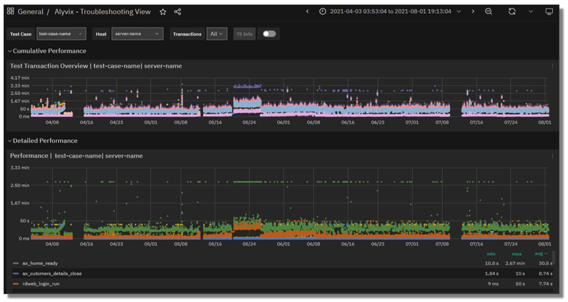
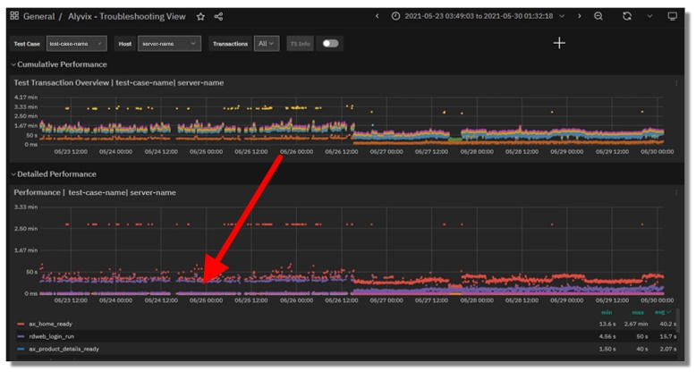
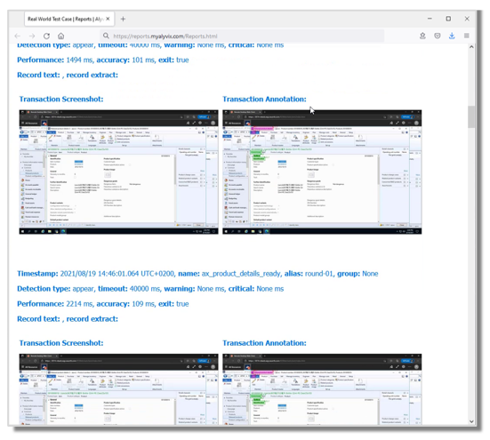

<!--BLOG ABSTRACT-->

It's not always clear how software tools that you've heard described
abstractly can be actually put to use in your company in a way that makes
business sense.

This article demonstrates the business case for using Alyvix to monitor
your networked, streamed and virtual applications by presenting a real world,
implemented use case in a Logistics company that uses Microsoft's Dynamics AX
platform over RDWeb.

Alyvix's Visual Monitoring approach can help you discover and solve IT
problems that end users often face like slow applications, which lead to low
productivity.  Read on to find out even more benefits of Alyvix.

===

<!--BLOG ARTICLE-->

## Introduction

So I'd like to pose a (rhetorical) question to you:  Who wouldn't like their
application performance to remain stable under load?

Obviously everyone would.  But we live in an imperfect world, and if
servers and networks always worked the way they were designed, then we
wouldn't need monitoring of any kind.

But let's focus on end users today.  From their point of view, it doesn't
matter if a disk is almost full or a network switch is acting up.  They
just need the computer in front of them to react to their keyboard and mouse
input, and to see the results on their screen.  Anything less than that
means they won't be getting their work done today.

So if you have a large number of end users dependent on networked-based
platforms such as Microsoft's Dynamics AX, what will happen when the
applications it hosts start slowing down?  Their productivity will go out
the window, and your business will suffer for it.

Applications on platforms like Dynamics AX are network centric.  So any
services they run can be slowed down or even blocked by problems with the
intermediate network or with the remote machine.

Today I'd like to show you a real world case of a logistics company that
uses Alyvix to *visually monitor* an actual production environment from
the point of view of its end users, i.e., the people who get things done.
Let's see how this company guarantees not just uptime, but productive
uptime.

## Guaranteeing The End User Experience

How can you find out when your users are having trouble with their
applications?  The best approach is finding out when problems are
small, before they take down all your end users.

The simplest way to check would be to assign someone to "use" every aspect
of each application, clicking on interfaces and typing away in order to
reproduce the tasks his or her coworkers' typically do, all day long,
every day.  There might even already be someone like that in your organization.

Needless to say, this would be expensive, really boring for that poor person,
and a waste of resources.

There's a different approach, though, that doesn't have these drawbacks.

Visual Monitoring is a kind of *automated assessment*, where you replace
the eyes and hands of that human tester with software that can continuously
and tirelessly perform, measure, and report on each individual step in all
those coworkers' workflows.

The *assessment* part refers to taking timing measurements of how long each
individual task step takes (e.g., typing in an order ID, or clicking to submit
a table of orders, or even of just logging in or out).  By *automated* I mean
having a certain task workflow be conducted by computer rather than by
person, and at frequent regular intervals.

Then whenever you want, either you or a computer monitoring system can look
at the latest measurements, even comparing them to historical values, to see
if the applications are running like they should.

## A Real World Example

Now let's get more specific and look at a real world example where this automated
approach is currently used to assess application performance on the widely
used Dynamics AX platform.

Consider a logistics company that uses Dynamics AX for its ERP and CRM.
These IT systems are the link between the company's employees and customers.
Any downtime may delay their invoices and contracts, interrupt delivery
schedules, all of which may send those customers to your competitors.

To keep critical applications for logistics running smoothly, an automatic
approach for this company regularly steps through the most important end
user tasks in Dynamics AX, like checking shipment status or filling in a form
for a new package.  The company defines how long these tasks (and task steps)
should take, and only needs to look at the collected data in graph form to
determine if expectations were met.

## Visual Monitoring

Visual Monitoring is the name of this automated approach that reproduces end
user task steps by clicking on the same buttons and typing into the same text
fields that users do.  At each step, when the GUI responds, the elapsed time
between the action and the GUI response is recorded.

This approach is specially suited to streamed and closed source applications
like RDWeb because it doesn't require programmatic access, just the standard
user interface.

So for instance in our Dynamics AX Logistics application, an end user task like
checking shipment status as shown here would include a step to type in a
shipment ID and then to click on the "Submit" button.  Then the elapsed time
is from when the button is clicked until when a window pops up with the result.

### Alyvix:  A Visual Monitoring Tool

Alyvix is a visual monitoring system for any Windows application or platform,
including Dynamics AX over RDWeb.  Alyvix has tools for creating scripts that
replicate end user workflows, and then automatically running them at regular
intervals, recording how long an end user would have to wait for each step
in the script.  It also creates reports that can certify application
performance to third parties.

On a business critical task like creating shipping invoices with Dynamics AX,
you use Alyvix to define each step within the shipping invoice interface, then
rerun those steps with an Alyvix *bot*, which uses Dynamics AX and its
application interfaces to automatically rerun the whole workflow just as if
it were a real end user.

### Alyvix: Automated UI Interaction

So what does it look like when Alyvix runs a bot on an interface like
a Dynamics AX application?  Just like a person, it logs in, clicks on
buttons or controls, types text in predetermined places a number of
times, and then logs out.  After each interaction with the interface,
it records how much time was needed for the application to respond with
the next stage of the interface, and captures a screenshot for later.
The robot runs like this automatically, repeating the same test each
time, at the interval that you set.

## Real Production Data Visualization

A simple way to visualize the timing data from these runs is a stacked
dot chart, where each point represents one step of one specific run,
where the distance from one dot to the next higher dot corresponds to
the amount of time that UI step took to complete, and where a
column represents all the steps in a single workflow.

When a second workflow is executed, the timing data for its steps is also
recorded.  As the bot runs more and more task workflows, you can see
both the recent workflow performance to find out if the application is
slow or not, and also compare it to prior performance results to see how
performance is trending over time.

In fact, once you've run the workflows long enough, you can visually
inspect the continuously recorded data to quickly note when the application
was down, see whether the user experience is improving or degrading over
time, and even gather data to help you decide proactively how to optimize
system resources, allowing you to save money by using the least amount of
resources necessary to maintain your user experience standards.

### Real Production Data Exploration

When looking for the causes of problems, it's extremely helpful to be able
to interactively visualize historic application performance data.  The chart
below shows 3 month's worth of data from a real world logistics application
over RDWeb in two interactive graphs.  The overview graph on top combines
latency and availability where each column represents the cumulative speed
of a particular work task run every 5 minutes, while the graph below shows
individual step completion times with a different color for each separate
step.

When the logistics company's IT department sees a stretch of high values
in the upper graph corresponding to application response times exceeding
the desired standard, system admins can drill down to the exact time period
when those values occurred in order to find the root cause.

For instance, if a bot running a Dynamics AX task flow makes a database
request as part of its interaction sequence, and the database at that
moment is slow because of networking issues, then the specific task step
using the database will be immediately visible in the graph just due to
its color.  Armed with this information you can plan ahead, for instance
by increasing network bandwidth, or scheduling downtime to fix the problem.

If instead the timing results are significantly high, setting alerts
or notifications allows you to intervene immediately when users
begin experiencing problems, even if they don't show up yet on other
monitored objective metrics like disk space or VM availability.

Expanding the performance graph and zooming in to the measurements
of individual steps allows you to pinpoint which transitions slowed down
and when.  You can even see when administrator interventions return
applications to their expected performance.

### Reports and Certification

The reports that Alyvix Server produces serve as permanent records which
can certify actual availability and performance over time.  They show the
total amount of time taken, whether the run as a whole was successful
or not, and provide detail on the individual steps.

For each step the report shows its individual timing measurements and
screenshots, indicating what was seen at each moment.  In particular, it
shows what the end user would have experienced when an application was
suffering slowdowns or not working at all.

If the logistics company used Dynamics AX as a remote service under an
SLA, a report with timing details and screenshots can serve as proof that
the SLA was being breached.

## Conclusion

As a visual monitoring system, Alyvix navigates through your remote
applications like Dynamics AX, executing tasks using the same graphical
interface that an end user does.

As each task is performed, Alyvix automatically and continuously assesses
application responsiveness, recording the time required for each transition
in the workflow, and saving screenshots for use in later troubleshooting.

Beyond increases in productivity and profitability because your end users
won't have to wait to finish their work, Alyvix can also help you optimize
your infrastructure by seeing slowdown trends, test changes to interfaces
in real time, retain multitenant customers who depend on your infrastructure,
and allow you to audit your SLAs.  No more excuses like "they said response
time was under a second".  You'll have proof if it was significantly worse.

Alyvix is the right tool for visual monitoring, providing everything you
need to monitor your networked and cloud applications.

<iframe width="288" height="162" src="https://www.youtube.com/embed/6bBhRZISaiw?color=white&rel=0" frameborder="0" allow="accelerometer; autoplay; encrypted-media; gyroscope; picture-in-picture" allowfullscreen></iframe>
