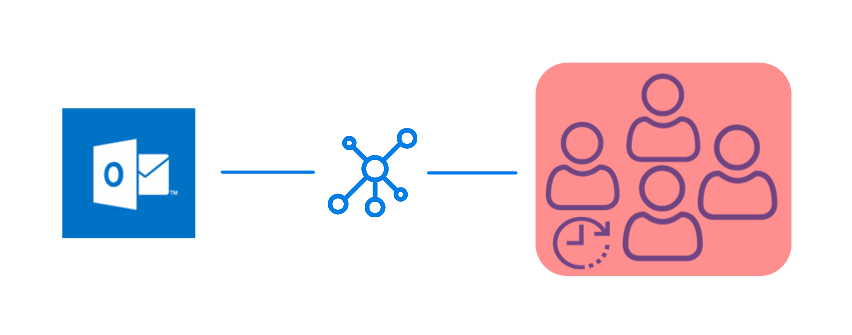
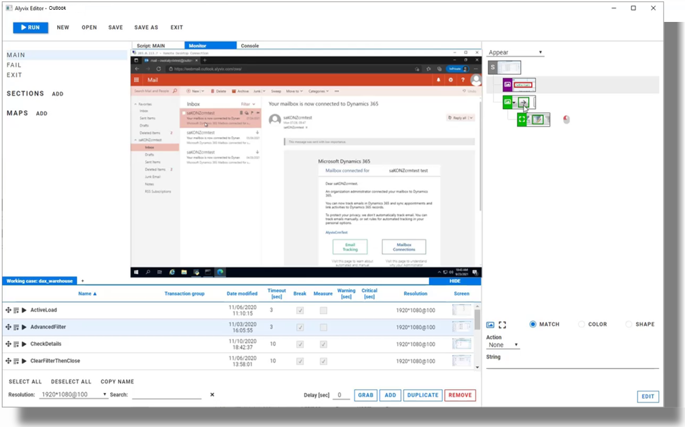
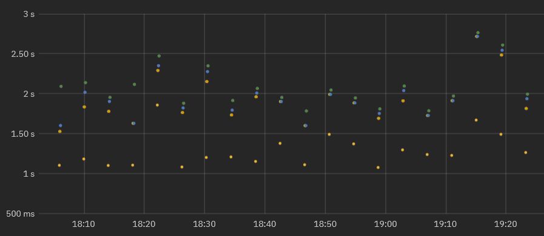
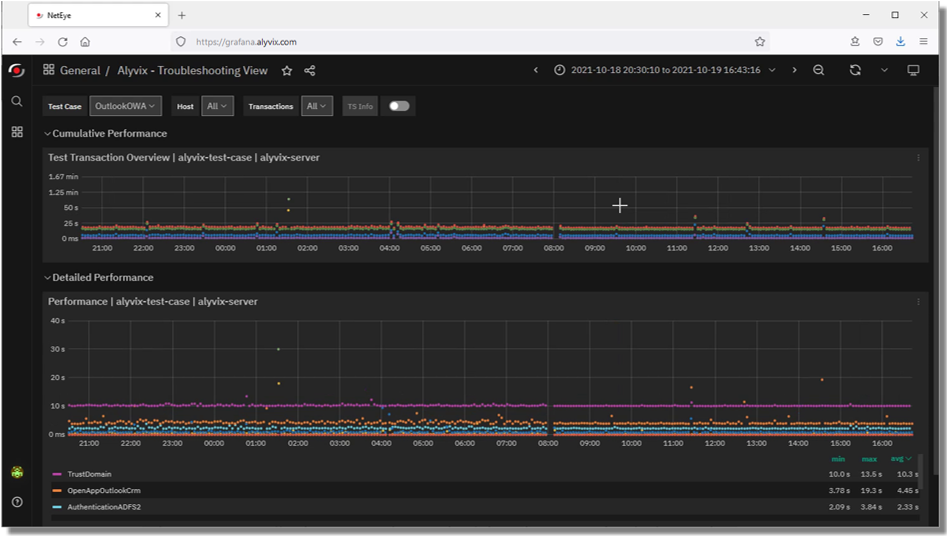
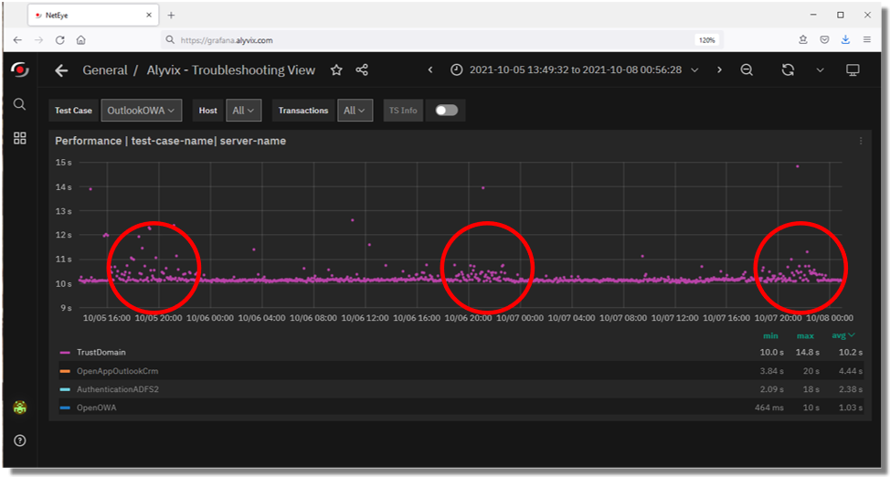
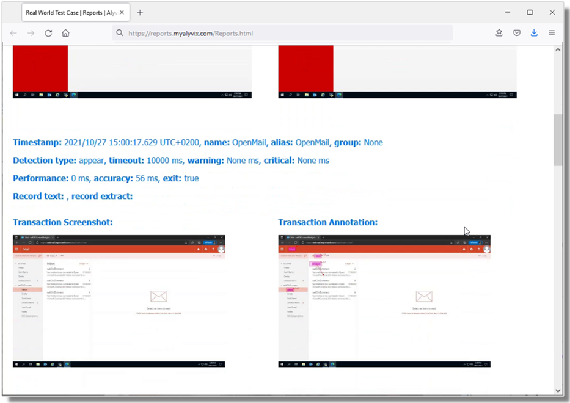

<!--BLOG ABSTRACT-->

Sometimes the best way to see how a software tool can help *you* is to see directly how it has helped *others*.  Seeing a real implemented example can help take out the abstractness of what software does and how it does it.

In this article we'll take a look at the business case for using Alyvix to monitor your networked, streamed and virtual applications.  In particular, we'll look at the performance of a Microsoft Outlook installation from the point of view of a client accessing email over the web.

We'll see how Alyvix's visual monitoring approach can bring IT problems to light, helping you both react to user perceptions of slow applications like email and be proactive in preventing problems from even occuring.  Read on to find out even more benefits of Alyvix.

===

<!--BLOG ARTICLE-->

## Introduction

We would all love to have applications that never go down and always have stable performance.  Then we wouldn't even need monitoring systems at all.  But in our real world, every component and piece of software can fail, and when the costs of failure are too great, we need to plan for it.

From the point of view of end users, it doesn't matter if a disk is almost full or a network switch is acting up.  In the case of networked email and calendar clients and servers, they just need the computer in front of them to reliably get contact information, quickly and flawlessly retrieve waiting email messages and send new ones on their way.  Failure means they will be wasting valuable time waiting for Outlook to respond.

Monitoring is most useful when we have a large base of end users, when we begin to apply economies of scale.  If you have a large number of end users who all must use networked-centric applications such as Microsoft's Outlook, what will happen when those applications start slowing down?  End user productivity will plummet, leading to bad business results.

Because applications like Outlook via the web are network centric, email and calendar service can be slowed down or even blocked by problems with the intermediate network or with the remote server.

How can you mitigate these problems?  Well, today I'm going to show you a real world case of an IT company that uses Alyvix to *visually monitor* its actual Microsoft Outlook production environment from the point of view of its end users, i.e., the people who need to communicate day in and day out to get their jobs done, and thus keep the entire business running.

## Guaranteeing The End User Experience

How can you find out when your users are having trouble with their applications?  The best approach is finding out when problems are small, before they take down all your end users.

The simplest way to check would be to assign someone to "use" every aspect of each application, clicking on interfaces and typing away in order to reproduce the tasks his or her coworkers' typically do, all day long, every day.  There might even already be someone like that in your organization.

Needless to say, this would be expensive, really boring for that poor person, and a waste of resources.  You need a different approach, though, one that's affordable, but works tirelessly and effectively.

Visual Monitoring is a kind of *automated assessment*, where you replace the eyes and hands of that human tester with software that can continuously and ceaselessly perform, measure, and report on each individual step in all those coworkers' workflows.

The *assessment* part refers to taking timing measurements of how long each individual task step takes (e.g., searching for an email address, opening a new incoming email, or even just logging in or out).  By *automated* I mean conducting a certain task workflow via computer rather than by person, and at frequent regular intervals.

Then whenever you want, either you or a computer monitoring system can look at the latest peformance measurements, even comparing them to historical values, to see if the applications are running like they should.

## A Real World Example

Now let's get more specific and look at a real world example where this automated approach is currently used to assess application performance for the ubiquitous Microsoft Outlook service.

Consider an IT company that uses Outlook email and calendar for much of its internal and customer- and provider-facing communications.  Any downtime or even significant slowdowns can impact every kind of communication the company needs, from invoices to contracts to meetings to advertising, reducing your competitive advantage.

To keep critical applications like Outlook running smoothly, an automatic approach for this company will regularly step through the most important end user Outlook tasks, like sending and receiving email messages, finding contacts and setting up and synchronizing meetings and appointments.  The company defines how long these tasks (and task steps) should take, and then only needs to look at the collected data in graph form to determine if expectations were met.

## Visual Monitoring

Visual Monitoring is the name of this automated approach that reproduces end user task steps by clicking on the same buttons and typing into the same text fields that users do.  At each step, when the GUI responds, the elapsed time between the action and the GUI response is recorded.

This approach is specially suited to monitoring streamed and closed source applications like most web applications because it doesn't require programmatic access, just the standard user interface.

So for instance in our Outlook service, an end user task like viewing someone's calendar would include one step to type in their email address and a second step to click on the "Submit" button.  Then the elapsed time is from when the button is clicked until when a window displays the calendar.

### Alyvix:  A Visual Monitoring Tool

Alyvix is a visual monitoring system for any Windows application or platform, including Microsoft's own applications like Outlook.  Alyvix has tools for creating scripts that replicate end user workflows, and then automatically running them at regular intervals, recording how long an end user would have to wait for each step in the script.  It also creates reports that can certify application performance to third parties.

On critical tasks like communicating with customers via email in Outlook, you use Alyvix to define each step within the email interface, then rerun those steps with an Alyvix *bot*, which uses Outlook's own interface to automatically rerun the whole workflow just as if it were a real end user sending or receiving an email.

### Alyvix: Automated UI Interaction

So what does it look like when Alyvix runs a bot on an interface like Outlook?  Just like a person, it logs in, clicks on buttons or controls, types text in predetermined places a number of times, and then logs out.

After each interaction with the interface, it records how much time was needed for the application to respond with the next stage of the interface, and captures a screenshot for later. The robot runs like this automatically, repeating the same tests each time (like sending an email message), at the interval that you set.

## Real Production Data Visualization

A simple way to visualize the timing data from these bots running through an Outlook task is a stacked dot chart, where each point represents one step of one specific run (e.g., pressing the Send button), where the distance from one dot to the next higher dot corresponds to the amount of time that UI step took to complete, and where a column represents all the steps in a single workflow (e.g., sending an email).

When a second workflow is executed, the timing data for its steps is also recorded.  As the bot runs more and more task workflows, you can see both the recent workflow performance to find out if the application is slow or not, and also compare it to prior performance results to see how performance is trending over time.

In fact, once you've run the workflows long enough, you can visually inspect the continuously recorded data to quickly note when the application was down, see whether the user experience is improving or degrading over time, and even gather data to help you decide proactively how to optimize system resources, allowing you to save money by using the least amount of resources necessary to maintain your user experience standards.

### Real Production Data Exploration

When looking for the causes of problems, it's extremely helpful to be able to interactively visualize historic application performance data.  The chart below shows 3 month's worth of data from a real world Outlook application operating over a network in two interactive graphs.  The overview graph on top combines latency and availability where each column represents the cumulative speed of a particular work task run every 4 minutes, while the graph below shows individual step completion times with a different color for each separate step.

When the IT company's own IT department sees a stretch of high values in the upper graph corresponding to application response times exceeding the desired standard, system admins can drill down to the exact time period when those values occurred in order to find the root cause.

For instance, if a bot running an Outlook task flow makes a database request as part of its interaction sequence, and the database at that moment is slow because of networking issues, then the specific task step using the database will be immediately visible in the graph just due to its color.  Armed with this information you can plan ahead, for instance by increasing processors or network bandwidth, or scheduling downtime to fix the problem.

If instead the timing results are significantly high, setting alerts or notifications allows you to intervene immediately when users begin experiencing problems, even if they don't show up yet on other monitored objective metrics like disk space or VM availability.

Expanding the performance graph and zooming in to the measurements of individual steps allows you to pinpoint which transitions slowed down and when.  You can even see when administrator interventions return applications to their expected performance.

### Reports and Certification

The reports that Alyvix Server produces serve as permanent records which can certify actual availability and performance over time.  They show the total amount of time taken, whether a given bot's run as a whole was successful or not, and provide detail on the individual steps.

For each step the report shows its individual timing measurements and screenshots, indicating what was seen at each moment.  In particular, it shows what the end user would have experienced when an application was suffering slowdowns or not working at all, for instance a popup window in Outlook showing a timeout message.

Since our IT company uses Dynamics AX as a remote service under an SLA, a report with timing details and screenshots could serve as proof that the SLA was being breached.

## Conclusion

As a visual monitoring system, Alyvix navigates through your remote applications and services like Outlook, executing tasks using the same graphical interface that an end user sees.

As each task is performed, Alyvix automatically and continuously assesses application responsiveness, recording the time required for each transition in the workflow, and saving screenshots for use in later troubleshooting.

Beyond increases in productivity and profitability because your end users won't have to wait to finish their work, Alyvix can also help you optimize your infrastructure by seeing slowdown trends, testing changes to interfaces in real time, retaining multitenant customers who depend on your infrastructure, and allowing you to audit your SLAs.  No more vendor excuses like "but our response time was under two seconds".  You'll have proof if it was significantly worse.

Alyvix is the right tool for visual monitoring, providing everything you need to monitor your networked and cloud applications.

<iframe width="288" height="162" src="https://www.youtube.com/embed/AoieebOwAI8?color=white&rel=0" frameborder="0" allow="accelerometer; autoplay; encrypted-media; gyroscope; picture-in-picture" allowfullscreen></iframe>
