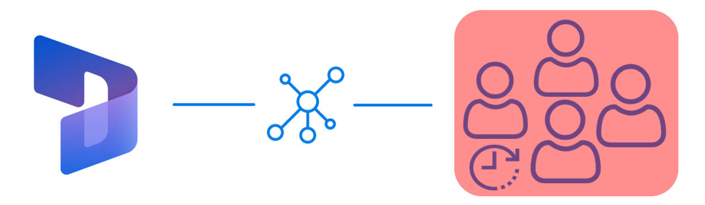
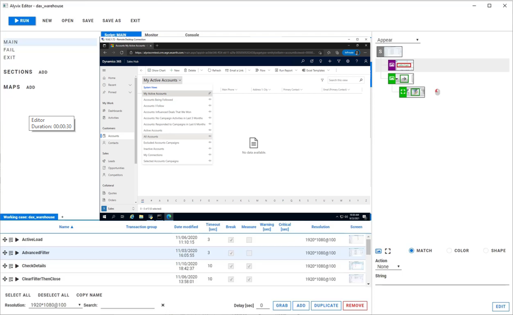
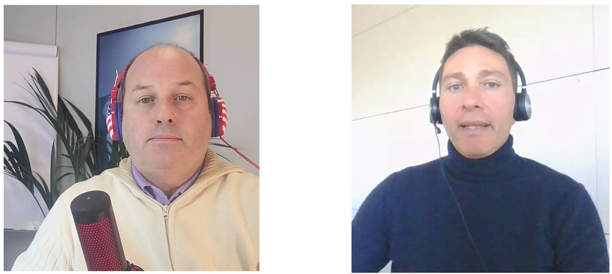
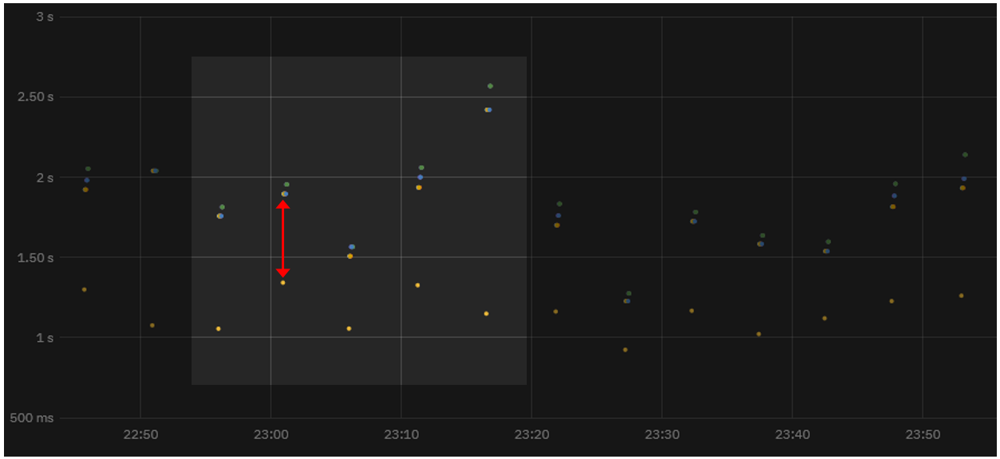
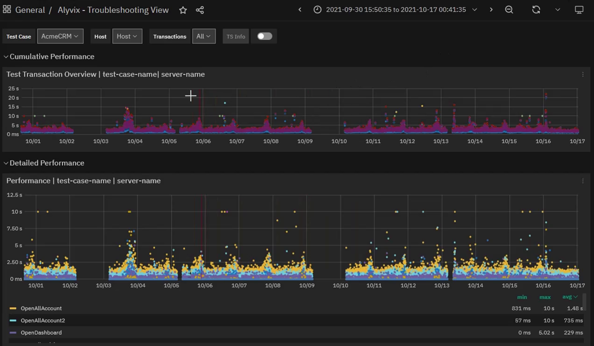
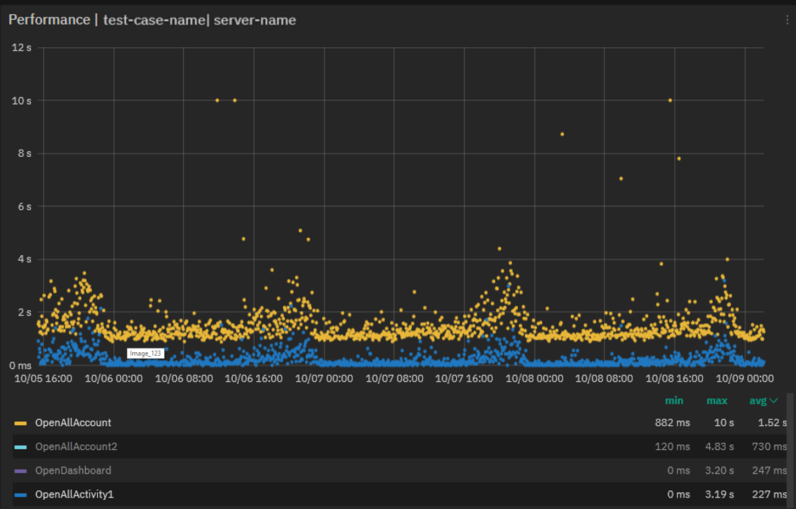
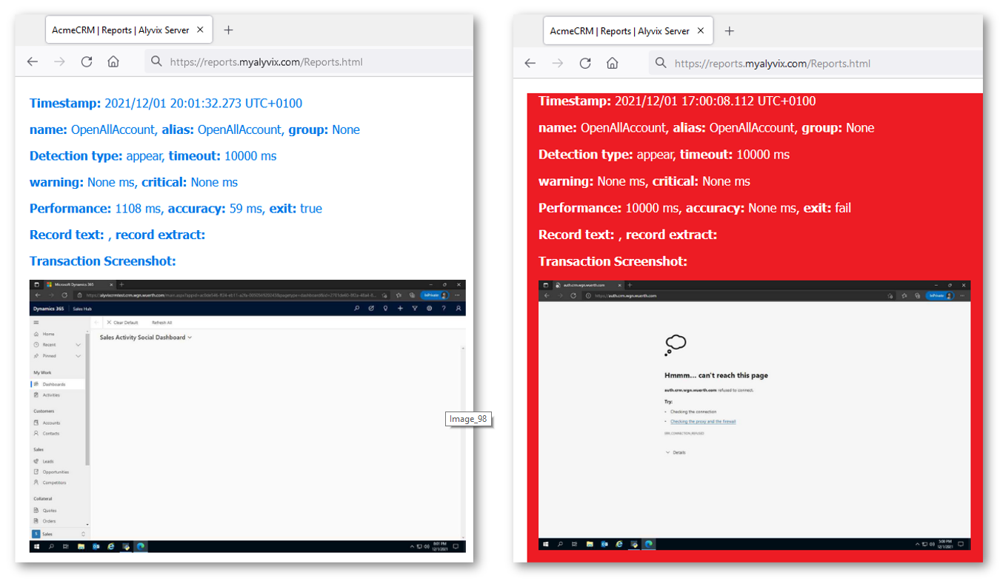

<!--BLOG ABSTRACT-->

You know that visual monitoring can be essential when monitoring the end user experience, but maybe you've thought it's too hard to implement by yourself.  Well then, join Mirko and me as he gives us some tips on how he builds his application checks in the real IT world, in this case for a CRM application on Microsoft's Dynamics 365.

===

<!--BLOG ARTICLE-->

## Introduction

We all know that a lot of times, nothing can replace seeing how someone else puts together the nuts and bolts of a sophisticated IT implementation, and configuring visual monitoring is no exception.  So we at Alyvix love giving you a good mix of videos and articles showing both how the Alyvix interface works as well as how Alyvix is used out in the real world.

So today let's look at how a CRM visual monitoring check was built by Mirko, who has extensive experience in both building Alyvix checks and making sure that the applications being monitored by those checks are properly responsive.

In particular we'll look at a check for a CRM application running on Microsoft's Dynamics 365 over RDWeb at a typical company -- after all, what company doesn't have clients and make sales?  And the larger the company, the more people are engaged in this activity.

Because this kind of application has a lot of end users at our company, and Dynamics 365 applications are network-dependent, any system or application down time will translate into a lot people sitting there twiddling their thumbs.

What you'd really like is for those applications to be up 24/7, and fast enough that staff can do their jobs efficiently.

Along with Mirko we'll look at using the *visual monitoring* approach to ensuring that you both know when apps are slowing down or failing, and that you have the information available at hand to concretely do something when the inevitable happens.  Read on to find out how.

## Guaranteeing The End User Experience

The purpose of *monitoring* is to make sure IT systems are working and responding quickly.  Similarly, the purpose of *visual monitoring* is to make sure that end user applications are working and responding quickly, where by *visual* we mean what the user is *seeing* or *experiencing* as they sit in front of their computer.

So how can you find out when your users are having trouble with their applications?  In general, the best approach is to find out as soon as possible when problems are still small, before they affect all of your end users.  So you need to continuously and frequently check that applications are expeditiously responding to user input.  But how?

The simplest way to check would be to select someone to pretend to be the user of a wide array of basic application tasks, walking through a series of repetitive workflows, clicking on interface elements just like their coworkers, and ready to tell IT admins as soon as they see a problem.  You might already have someone in your organization who does this.

I don't need to tell you that this approach is expensive, really boring for the person chosen, and a waste of resources.  Nobody wants to do it, and in fact this task is a prime candidate for automation, with everyone's blessing.  So below I want to tell you about how you can automate it, using software that works tirelessly and effectively, to do this thankless task.

Visual Monitoring is a kind of *automated assessment*, where you replace the eyes and hands of the human tester mentioned above with software that can continuously perform, measure, and report on each individual step in their coworkers' workflows.

The *assessment* part refers to regularly measuring how long each individual task step takes (e.g., maintaining sales contact information, producing sales forecasts, or even just logging in or out).  The *automated* part means to carry out a certain task workflow via computer rather than manually, and at regular intervals with a frequency that would be impossible for a human to match.

Then when you want to respond to a problem or even prevent a future one, you (or an automated computer monitoring system) can look at the latest performance measurements, even comparing them to historical values, to see if the applications are as responsive and fast as they should be.

### Alyvix:  A Visual Monitoring Tool

Alyvix is a visual monitoring system for any Windows application or platform, including applications that run on Microsoft's Dynamics 365 platform.  Alyvix provides tools for creating scripts (or *bots*) that replicate end user workflows, and then automatically run those scripts over and over at regular intervals, recording each time how long an end user has to wait for every step in the script.  It also creates reports that can be used to certify application performance to third parties.

On critical CRM tasks like coordinating marketing campaigns, estimating future sales income or recording customer interactions, you use Alyvix to define each step within the Dynamics 365 interface, then rerun those steps with an Alyvix bot, which uses the application's own interface to automatically re-step the whole workflow, just as though it were a real end user adding a new client record or inserting sales proposals.

### A Check Builder's Perspective

Who knows how to create an Alyvix bot like that more than someone who does it professionally for a living.  In fact, the Alyvix check showcased in the [related video](https://www.youtube.com/watch?v=EK9e3Q17ivE) was built by Mirko for an actual customer.  Here are some notes from Mirko in a recent conversation I had with him:

> Mirko:
>
> From my experience before you start to create a check I recommend you
> sit down with the customer to define what should be monitored, how often,
> and what are acceptable response times for the application.
>
> Once you clarify this, creating checks will be quick, given the
> integration with our system.  By looking at the monitoring graphs we
> can quickly intervene before the end user encounters problems.
>
> And then correctly defining Fail and Exit sessions is particularly
> important when creating an Alyvix check.  If there are unexpected
> system reactions, this lets us get everything working again the moment
> the problem goes away.

We'll get some more suggestions from Mirko on maintaining your checks below.

### Alyvix: Automated UI Interaction

So what does it look like when an Alyvix bot runs and begins interacting with a Dynamics 365 application like CRM?  Just like a person, it logs in by typing in its account credentials, navigates through menus, clicks on buttons or controls, fills in form fields by typing in text, waits for a result, and then logs out.

After each one of these single interactions with the interface, the Alyvix bot measures and records how much time was needed for the application interface to respond (typically by updating the GUI), and captures a screenshot that can be used later. The bot runs like this automatically, repeating all the steps in the check over and over (like testing whether sales graphs appear), at the interval that you set.

## Real Production Data Visualization

A simple way to visualize the timing data from a bot running through a CRM task is to use a stacked dot chart, where each point represents one step of one specific run (e.g., pressing the Submit button on a customer's address update form), where the distance from one dot to the next higher dot corresponds to the amount of time that a particular step took to complete, and where an entire column represents all the steps in a single task (e.g., modifying a customer record).

When a second workflow is executed, the timing data for its steps is also recorded and a second column of dots is added.  As the bot runs more and more task workflows, you can see both the recent workflow performance (compare the cumulative time to, say, a few hours earlier to find out whether or not the application is slower now), and also compare it to historical performance results (using a graph visualization system) to see how performance is trending over longer periods of time.

In fact, once your Alyvix bot has run enough workflows, you can visually inspect the continuously recorded data to quickly note when an application was down, see whether the user experience is improving or degrading over time, and even to find out ahead of time which system resources need to be changed, allowing you to save money by using the fewest resources necessary to keep the end user experience within your (and their) expectations.

### Real Production Data Exploration

When looking for the causes of problems, it's extremely helpful to be able to interactively visualize historic application performance data.  The chart below shows 3 month's worth of data from a real world CRM application on Dynamics 365 as it operates across a network.  The overview graph on top combines latency and availability as in our dot chart above.  Each column represents the cumulative speed of one particular CRM task run every 4 minutes, while the graph below shows how long each step took to complete independently, with a different color for each separate step.

When our company's internal IT department sees a lengthy series of high values in the upper graph meaning that application response time exceeds the desired standard, system admins will be able to visually see that there's a problem, and drill down through the graphs to find the exact time period when those values occurred, helping them locate the root cause.

For instance, if a bot running a marketing task flow makes a file request as part of its interaction sequence, and the disk at that moment is slow due to hardware issues, then the performance of the specific task step waiting on the disk will be immediately visible in the graph just due to its color.  Armed with this information you can plan ahead, for instance by adding virtual disks or increasing network bandwidth, or scheduling downtime to fix any problems.

If instead the timing results are significantly high, setting alerts or notifications allows you to intervene the moment that users begin experiencing problems, even if those problems don't show up yet on other monitored objective metrics like disk space or VM availability.

Zooming in on the performance graph and filtering out the measurements of individual steps allows you to pinpoint which transitions slowed down and when.  You can even see when scheduled or emergency interventions return applications to their expected performance.

### Reports and Certification

The reports produced by Alyvix Server are permanent records which can serve as certification of actual availability and performance over time.  They show the total time taken, whether a given bot's run as a whole was successful or not, and also provide detail about each individual step.

The report shows individual timing measurements and screenshots for each step, showing what was seen by Alyvix (and thus would be seen by the user) at each moment.  In particular, it shows how long workflow steps took to complete and what was seen onscreen when an application was suffering slowdowns or not working at all, for instance if after pressing "Submit", a confirmation popup window never appeared.

If the company uses Dynamics 365 as a remote service under an SLA, a report with specific timing details and screenshots can serve as proof that a particular SLA was being breached.  In the example below you can see the difference between the typical, successful outcome on the left, and the application with an error dialog on the right:

### A Check Maintainer's Perspective

Our visual monitoring check builder Mirko also regularly maintains the checks he builds, for instance adjusting graphics after an operating system update.  I asked him if he has any advice from that point of view.

> MIRKO:
>
> As for maintaining your checks, if the implementation was
> done right in the first place then it will require very little
> work.  You just have to pay attention that during checks, windows
> and dialog boxes that are not part of the application or part of
> the Alyvix test case do not appear, because they will cover up the
> things we want Alyvix to look for.
>
> Furthermore, if you're conducting a check on a remote machine you
> must be sure that the video frame rate is good, or else Alyvix will
> see distortions instead of the graphic it's looking for so it can
> click on it.
>
> Otherwise, thanks to integration with the monitoring system,
> actually intervening to fix problems is the easy part.

Thanks Mirko, you're an end user's best friend!

## Conclusion

Alyvix is a visual monitoring system that navigates through your applications and services, including network-based applications like Microsoft's Dynamics 365, executing tasks in the existing graphical interface that end user already use.

As Alyvix performs each task, it automatically and continuously assesses application responsiveness, both recording the time needed for each transition in the workflow from user input to application/system response, and saving screenshots for use in later troubleshooting or SLA certification.

Beyond increases in productivity and profitability because your end users won't be blocked from finishing their work, Alyvix can also help you optimize your infrastructure by testing changes to interfaces in real time, seeing slowdown trends, and retaining multitenant customers who depend on your infrastructure.  No more vague vendor excuses about high availability.  You'll have proof if it was significantly worse.

Alyvix is the right tool to help you monitor your own applications visually, providing everything you need to check on your local, cloud and networked applications from the point of view of your end users.

<iframe width="288" height="162" src="https://www.youtube.com/embed/EK9e3Q17ivE?color=white&rel=0" frameborder="0" allow="accelerometer; autoplay; encrypted-media; gyroscope; picture-in-picture" allowfullscreen></iframe>
