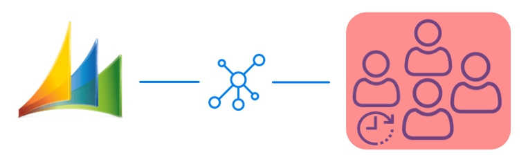
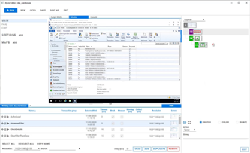
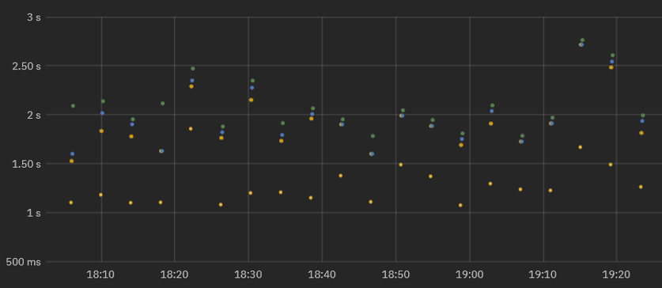
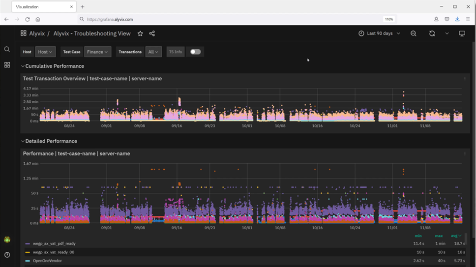
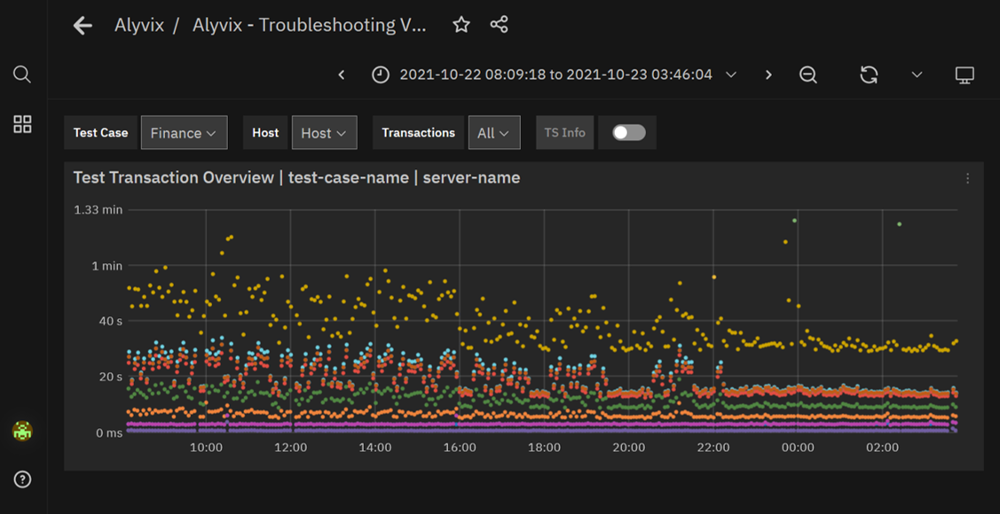
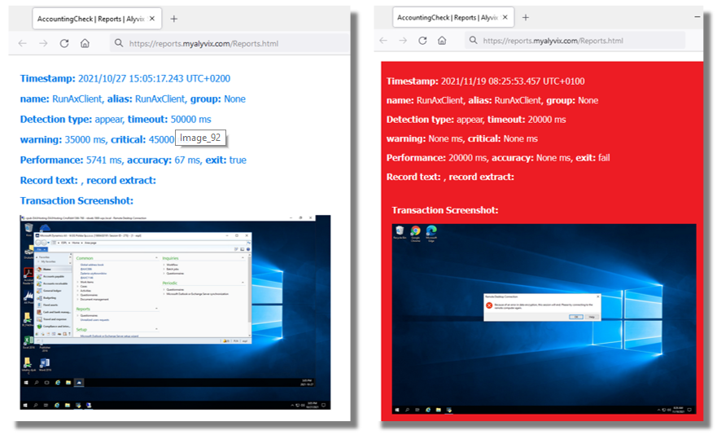

<!--BLOG ABSTRACT-->

Here at Alyvix we just love showcasing actual implemented examples where Alyvix has helped real organizations to monitor their user-facing applications.  There's just something about concrete uses that gives them a more immediate impact than generic explanations.

So today we'll consider a typical mid-sized company with a standard accounting/finance department and thus some employees who need to carry out typical accounting tasks.  This company integrates all of its internal services with Microsoft's Dynamics AX over RDC, so each employee works on their tasks as a network-based application.

As I'm sure you've experienced for yourself, these networks and systems can have good days and bad days, but what you'd really like is for them to always be there when your employees need them, and to always provide a level of performance that lets them get their jobs done.

So in this article we'll describe how Alyvix can do this monitoring task, ensuring the required level of performance and responsiveness in Dynamics AX accounting applications, by employing a *visual monitoring* approach.  Read on to find out what that is, and how Alyvix can deliver even more benefits to your organization.

===

<!--BLOG ARTICLE-->

## Introduction

Who wouldn't love to have applications that never go down and that always have stable performance.  Then we could save all that hassle with monitoring.  But in reality, software and hardware can perform progressively worse or even fail, and planning ahead is vital when the risk of failure is high.

From the point of view of end users, the reasons their applications go down doesn't matter.  In the case of vital software services that run in networked environments and over the cloud, accounting users just need the applications they're working on to reliably post to accounts, set up invoices, and check balances.  If they can't, they'll be wasting valuable time, and most likely all other users will be too.

Monitoring is more useful when there are more and more end users, allowing us to apply economies of scale.  If you have a large number of end users who depend all day long on networked-based applications on platforms such as Microsoft's Dynamics AX, what will happen when those applications start slowing down?  Those end users will spend a lot of time waiting, leading to lower productivity, and correspondingly leading to worse  business results.

So since accounting applications can be slowed down or even blocked just as much as any other application, regardless of the fact that no business can continue to operate without fulfilling their basic accounting tasks, you need a way to keep them constantly working well.

How can you do that?  Well, today I'll show you a real world case of a mid-sized company that uses Alyvix to *visually monitor* its accounting applications and services on its production environment Microsoft Dynamics AX server.  In terms of productivity, what's most important here is whether end users can get their jobs done, and thus keep the entire business running.  Standard monitoring can help, but only visual monitoring centered around actual users can tell you whether they can work at any given moment.

## Guaranteeing The End User Experience

So how can you find out when your users are having trouble with their applications?  In general, the best approach is finding out when problems are small, before they take down all your end users.  More specifically, you need to continuously check that applications are expeditiously responding to user input.  How?

The simplest way to check would be to assign someone to pretend to be a user, stepping through every aspect of each application, clicking on interface elements and typing in input fields in order to reproduce the typical tasks his or her coworkers do, all day long, every day.  You might already have someone in your organization who does this task.

Needless to say, this effort is expensive, really demotivating for that person, and a waste of resources.  So below I want to tell you about a different approach, one that works tirelessly and effectively, and yet is totally affordable.

Visual Monitoring is a kind of *automated assessment*, where you replace the eyes and hands of the human tester mentioned above with software that can continuously perform, measure, and report on each individual step in all those coworkers' workflows.

The *assessment* part refers to regularly measuring how long each individual task step takes (e.g., posting new receivables, updating client invoices, or even just logging in or out).  By *automated* I mean conducting a certain task workflow via computer rather than by the human tester above, and at regular, frequent intervals, which would be impossible for a human to do.

Then whenever you want, you (or an automated computer monitoring system) can look at the latest performance measurements, even comparing them to historical values, to see if the applications are as responsive and fast as they should be.

## A Real World Example

Let's get a bit more into some details and look at a real world example where this automated approach of visual monitoring is currently used to assess application performance for Microsoft's Dynamics AX platform of services.

Consider our mid-sized company that uses Dynamics for almost all internal applications like ERP and CRM, including accounting and finance services.  Any downtime or even slowdown has a huge impact on how fast employees can finish their assigned tasks.  What will a company do when it falls behind on accounts receivables because users can't access their systems.

To keep these critical applications running like clockwork, an automatic approach regularly steps through a sample of the most important end user tasks.  What the tasks consist of and how long they should take is defined by the company itself.  Once Alyvix begins its visual monitoring work, system administrators then only need to look at the collected data in graph form to determine if and when interventions are necessary to restore service, almost immediately after they begin to go down.

## Visual Monitoring

This automated approach that reproduces end user task steps by clicking on the same buttons and typing into the same text fields that users do is called *visual monitoring*.  At each step, when the application responds to Alyvix's inputs in the GUI, the elapsed time between the input and the response is recorded.

This approach is specially suited to monitoring streamed and closed source applications like most web applications because you don't need to be a programmer to interact with them, Alyvix can move the mouse and type with the keyboard just like a person does, using Windows' own interface.

So for instance in our accounting application on Dynamics AX, an end user task like filling out an invoice would include steps to find and type in the name, address and amounts, and a final step to click on the "Submit" button.  Then the elapsed time for that last step is from when the button is clicked until when a window displays the confirmation.

### Alyvix:  A Visual Monitoring Tool

Alyvix is a visual monitoring system for any Windows application or platform, including those that run on Microsoft's Dynamics AX platform.  Alyvix gives you tools to create scripts that replicate end user workflows, and then automatically run them at regular intervals, recording the amount of time an end user has to wait for each step in the script.  It also creates reports that can be used to certify application performance to third parties.

On critical tasks like updating accounts receivable and payable, you use Alyvix to define each step within the Dynamics AX interface, then rerun those steps with an Alyvix *bot*, which uses the application's own interface to automatically rerun the whole workflow, just as if it were a real end user checking balances or inserting invoices.

### Alyvix: Automated UI Interaction

So what does it look like when Alyvix runs a bot that interacts with a Dynamics AX application?  Just like a person, it logs in by typing in its account credentials, navigates through menus, clicks on buttons or controls, fills in form fields by typing in text, waits for a result, and then logs out.

After each one of these single interactions with the interface, the Alyvix bot measures and records how much time was needed for the application interface to respond (typically by updating the GUI), and captures a screenshot for later. The robot runs like this automatically, repeating all the steps in the test over and over (like testing the retrieval of an invoice), at the interval that you set.

## Real Production Data Visualization

A simple way to visualize the timing data from a bot running through an accounting task is to use a stacked dot chart, where each point represents one step of one specific run (e.g., pressing the Submit button), where the distance from one dot to the next higher dot corresponds to the amount of time that a particular step took to complete, and where an entire column represents all the steps in a single task (e.g., submitting an invoice).

When a second workflow is executed, the timing data for its steps is also recorded and a second column of dots is added.  As the bot runs more and more task workflows, you can see both the recent workflow performance (to find out whether or not the application is slow), and also compare it to prior performance results (using a graph visualization system) to see how performance is trending over time.

In fact, once your Alyvix bot has run enough workflows, you can visually inspect the continuously recorded data to quickly note when the application was down, see whether the user experience is improving or degrading over time, and even gather data to help you plan ahead of time how to optimize system resources, allowing you to save money by using the least resources necessary to keep the end user experience within expectations.

### Real Production Data Exploration

When looking for the causes of problems, it's extremely helpful to be able to interactively visualize historic application performance data.  The chart below shows 3 month's worth of data from a real world accounting application on Dynamics AX that's operating over a network.  The overview graph on top combines latency and availability as in our dot chart above.  Each column represents the cumulative speed of our accounting task run every 4 minutes, while the graph below shows how long each step took to complete independently, with a different color for each separate step.

When our company's internal IT department sees a long sequence of high values in the upper graph meaning that application response time is exceeding the desired standard, system admins can visually see there's a problem and drill down in the graphs to find the exact time period when those values occurred, helping them find the root cause.

For instance, if a bot running a tax-based task flow makes a database request as part of its interaction sequence, and the database at that moment is slow due to networking issues, then the performance of the specific task step using the database will be immediately visible in the graph just due to its color (yellow in the graph below).  Armed with this information you can plan ahead, for instance by increasing processors or network bandwidth, or scheduling downtime to fix any problems.

If instead the timing results are significantly high, setting alerts or notifications allows you to immediately intervene when users begin experiencing problems, even if they don't show up yet on other monitored objective metrics like disk space or VM availability.

Zooming in on the performance graph and filtering out the measurements of individual steps allows you to pinpoint which transitions slowed down and when.  You can even see when administrator interventions return applications to their expected performance.

### Reports and Certification

The reports produced by Alyvix Server serve as permanent records which can certify actual availability and performance over time.  They show the total time taken, whether a given bot's run as a whole was successful or not, and provide detail on every individual step.

The report presents individual timing measurements and screenshots for each step, showing what was seen at each moment.  In particular, it shows what a real end user would have experienced when an application was suffering slowdowns or not working at all, for instance that after pressing "Submit", a popup window displayed a timeout message.

Because our mid-sized company uses Dynamics AX as a remote service under an SLA, a report with specific timing details and screenshots can serve as proof that the SLA was being breached.  In the example below you can see the difference between the typical, successful outcome on the left, and the missing application with an error dialog on the right:

## Conclusion

Alyvix is a visual monitoring system that navigates through your remote applications and services like accounting applications on Dynamics AX, executing tasks the existing graphical interface that every end user already uses.

As Alyvix performs each task, it automatically and continuously assesses application responsiveness, recording the time needed for each transition in the workflow from user input to application/system response, and saving screenshots for use in later troubleshooting.

Beyond increases in productivity and profitability because your end users won't have to wait to finish their work, Alyvix can also help you optimize your infrastructure by testing changes to interfaces in real time, seeing slowdown trends, retaining multitenant customers who depend on your infrastructure, and making it possible for you to audit your SLAs.  No more vendor excuses like "our response time is usually under two seconds".  You'll have proof if it was significantly worse.

Alyvix is the right tool to help you monitor your own applications visually, providing everything you need to check on your networked and cloud applications from the point of view of your end users.

<iframe width="288" height="162" src="https://www.youtube.com/embed/S8NI9chUeY8?color=white&rel=0" frameborder="0" allow="accelerometer; autoplay; encrypted-media; gyroscope; picture-in-picture" allowfullscreen></iframe>
