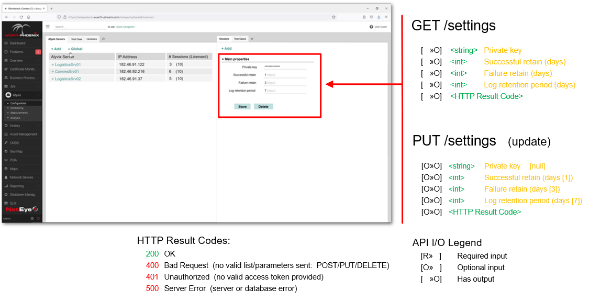

<!--BLOG ABSTRACT-->

Many IT administrators already have a fully configured monitoring system that they've invested a significant amount of time in, including setting up contacts for notifications and alerts, learning the data analysis tools they're now familiar with, and more.

This conceptual exploration (and the [accompanying video](https://www.youtube.com/embed/8_MoUNlB1jY)) illustrates how an Alyvix Service can be integrated into the NetEye 4 monitoring system with a potential implementation. It also describes the Alyvix Service API that will enable full, native integration with any monitoring system via a RESTful approach.

===

<!--BLOG ARTICLE-->

## Introduction

Today the subject is integration, and the two objects are Alyvix Service and NetEye 4.

Whenever you log in to your NetEye installation, wouldn't it be great if all your Alyvix data and settings were immediately available at your fingertips, without having to ever leave NetEye?

No more having two separate web pages open, logging in multiple times, or juggling different user permissions.  Plus you could take advantage of NetEye's data visualization tools and raise alerts and notifications based on KPIs identified by Alyvix.

So how would that work?  Well, it's still a work in progress, but also in this article I'll show you a preview of the API that's being used to build it all out.

## An Integration Scenario

Let's start with NetEye's dashboard to see how this integration can make things easier for you.  Alyvix lets you monitor the availability and responsiveness of applications, and each individual Alyvix test case is shown as a separate *service* within NetEye.

So suppose we see a monitored Alyvix Service that's critical, like the service in the screen below called *generic-alyvix3*.  As with all services in NetEye, we can click on the service's name to go to the details panel for more in-depth information.

Once this detail panel appears, we can explore any problems with the full array of NetEye's tools.  But first, let's take the opportunity to see how we can use the Alyvix Service API to configure both global Alyvix Service settings within NetEye 4 as well as the parameters of a specific Alyvix Service, its sessions, test cases, etc.

## Configuring an Alyvix Service within NetEye

From the Alyvix Service tab in the configuration section you can view which servers have been set up, where they're located, and how active they are.  Just click on a server name to modify or delete it.

Similarly, changing global parameters is just one click away: the private key for encrypting session credentials, and the retention periods (in days) for records of successful test cases, failed test cases, and user annotation logs:

From the configuration page you can also add, edit or remove sessions, which are groups of test cases that are monitored on a particular machine and user account.  Each session is viewable under the server it is registered with:

And in turn the aliased test cases scheduled to run in those sessions are also viewable.  Each test case you've created with Alyvix can be fully configured with any parameters needed to customize how they run and what information they save.

Test case files can be assigned to multiple sessions either in their standard version, or with specialized arguments that can be applied within some sessions but not in others.

Once the sessions and Alyvix test cases have been defined, NetEye will begin to actively monitor your applications by running those test cases at set intervals on the target machines.  The resulting data is then collected and recorded so you can explore it later, or set notifications and alerts at certain thresholds within your existing NetEye environment.

The last configuration panel lets you check whether the license for an Alyvix Service is close to expiration so that you can update them as needed.  Here yellow indicates a license is close to expiration, red indicates it has already expired, and grey means it has been temporarily disabled.

## Visualizing Collected Data

The raw data produced by Alyvix test cases can be explored by switching to the Measurements tab and browsing the individual fields displayed in their native JSON format.  You can also add and view log messages that serve as annotations to the data.  Our [other Alyvix Server videos](https://www.youtube.com/watch?v=L_jEDSyKvGo) explain more in-depth what these data structures contain.

The Analysis link lets you explore Alyvix data collected by test cases over long time periods.  This includes interactive graphs detailing the availability and responsiveness of your application, both as a whole and across individual tasks within the application.

Once an Alyvix Service is integrated into NetEye, you can use all the power and features of Grafana to explore your test case results, just as NetEye uses Grafana to visualize its own monitored data.

The service detail panel for an Alyvix test case shows one or more graphs of individual Alyvix measures over recent history.  These are less interactive than the full scale Grafana interface, but they also load much more quickly and can often give you just a quick overview of trends and maxima if you don't need to see all the details.

## The Alyvix Service API

Now let's turn to the technical details underlying Alyvix-NetEye integration.

The Alyvix Service API is RESTful, with a defined set of endpoints, allowing data to be both sent and received via HTTPS.  Below we'll look at each one of these endpoints in turn.

Each Alyvix Service has its own IP address, and NetEye keeps track of both them and their separate endpoints.  The 'Add' action on this page brings up another panel where a new Alyvix Service instance can be added and configured, while clicking on the name of an existing server allows the parameters specific to it to be modified.

### Settings and Sessions

Global configurations for all Alyvix Service instances and sessions can be changed by users with the appropriate permissions, as well as being set and retrieved through the endpoint shown.

These settings include the private key, and how many days to retain successful test case results, failed test case results, and event annotation logs.

The session settings describe how an Alyvix Service should connect to a Windows machine when it runs a session's test cases on that machine, along with the graphics parameters it should use.  It also passes arguments that control when and how often test cases should be run.

### Test Cases

This set of endpoints allows you to manage the actual Alyvix test case files that NetEye uses before it can display or configure the test cases.

The next two endpoints let you retrieve file information and parameters of a set of Alyvix test case files, including runtime parameters specific to each individual test case, in order to populate a table where NetEye administrators can view them.  Importantly, this includes the unique ID for each test case, which is used to distinguish test cases from each other.

Alyvix test cases can then be added, modified, or deleted by using the endpoints with writeable actions.  The first PUT method below is used to reorder the test cases globally, across all sessions and machines.  The POST method allows you to add a new test case with the desired parameters, and then returns a unique ID so you can then reference it.  You can then modify or delete them with that ID.

### Licenses

The licenses endpoints provide access to reading or writing individual license certificates, as well as reading the status of all known licenses so that they can be displayed in a table within NetEye.

### Measurements

The raw data produced by Alyvix test cases can be retrieved according to the following endpoints.  The API for measurements is related to that described in [the Alyvix Server manual](https://alyvix.com/learn/server/measurement_web_apis.html).

### Logging

Logging annotations can be retrieved with the *log* endpoint, while a new log annotation can be added by posting either a text string entered by the user or one generated by the system, to that same endpoint.

## Conclusion

The RESTful server and endpoints described above allow for the easy integration of any Alyvix Service within NetEye, with benefits for NetEye users and administrators that include simple configuration of one or more Alyvix Service instances, interactive analysis of the resulting data, and integration with existing NetEye configurations for notifications, alerts, etc.

<iframe width="288" height="162" src="https://www.youtube.com/embed/8_MoUNlB1jY?color=white&rel=0" frameborder="0" allow="accelerometer; autoplay; encrypted-media; gyroscope; picture-in-picture" allowfullscreen></iframe>
