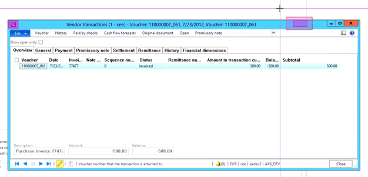
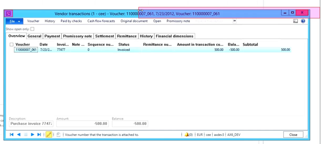
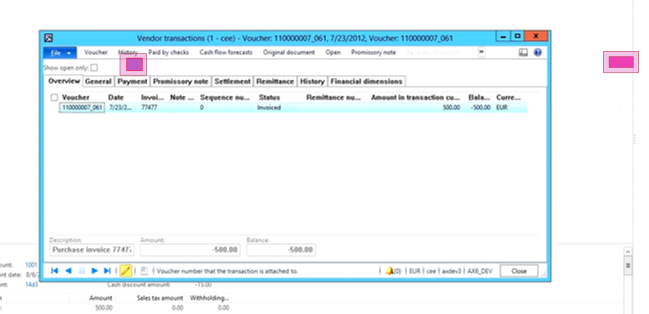
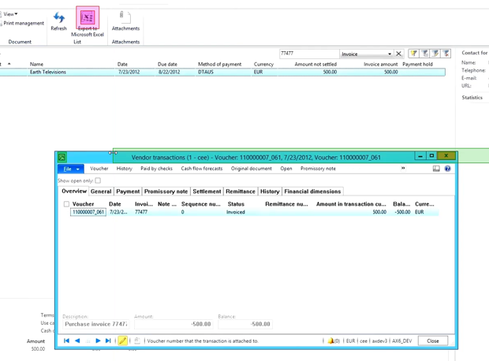
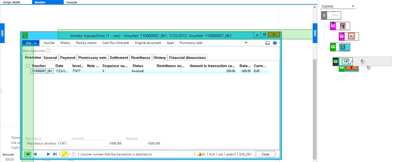

<!--BLOG ABSTRACT-->

If you've worked with Alyvix for a few years, perhaps you've noticed every so often that your test cases stop working for no apparent reason.  If the underlying problem isn't an actual system fault (congratulations, your monitoring is working as intended!) then the cause is almost always a change in the interface that you're monitoring.

While some large "breaking" changes will obviously require you to create a new Alyvix test case, more often it's just a minor change, for instance Alyvix can't find a button that's been moved due to a software update, or a multi-user system has persistent window properties.  In this best practices blog, I'll show you how you can build more robust test cases so that these minor interface changes won't interrupt your monitoring and keep you from rebuilding your test cases.

===

<!--BLOG ARTICLE-->

# Introduction

Have you ever had an Alyvix test case stop working, and not because the system being monitored was actually down?  The culprit is almost always because the interface you're matching against and interacting with has changed in some way.

Obviously if an interface you're monitoring changes drastically, you'll probably have to make a completely new test case.  But what usually happens is that an interface will change gradually, a little bit here and there over time.  If you do just the bare minimum when building your test cases, you'll likely have to rebuild them each time there's a small change.

So how can you make your Alyvix test cases more robust, so that they won't break just because a software update moved a button a bit to the left?  Well, it turns out that there's a right way and a wrong way to build your test cases.  And learning the right way *now* means you won't have to spend as much time later on fixing them.

# Some Background

Real quick let's review some concepts you may have already picked up from reading our Alyvix user manual or watching our Alyvix operations videos...

To get Alyvix to recognize and interact with an image or a box or a piece of text, you draw a selection rectangle around that target.  A selection can be any size, and you can have up to four of them in a group, where you can tell which group it is by the color of the selection (red, green or blue).  Each selection also has a larger rectangle around it called the *region of interest*.

What Alyvix does is it tries to match the selection anywhere within its own region of interest, where the regions in a group must be in the same position relative to each other, *but only* within that group, not the regions in other groups.  Groups are independent of each other in terms of position, but they're matched in the order they're listed in the component tree.

Alyvix also gives you a few helpful options you can use to expand the region of interest, like dragging its edges, or right-clicking on an edge to expand it to infinity in its direction.

# Two Examples

Both selections and groups are tools that can help you whenever there are minor variations on the screen so you won't have to update your Alyvix test case.  Let's look at two examples:  one when subwindows are resized, and then when they're repositioned.  In both cases, let's say a window has popped up for a task, we've now done the task, and we're ready to close that window.

When a window is resized or repositioned between one run of Alyvix Robot and the next, then a properly robust test case will still work despite those changes.  If it's not built following best practice, you risk breaking the test case and thus having gaps in your monitoring data, and having to fix the test case before you   can continue monitoring.

## Example #1:  Resized Windows

Our first example is a pop-up subwindow that for some reason has changed its size compared to when we created the test case.  This can happen for instance when applications remember the size of your windows after the last session (persistence), but it could also be menus, tables, forms, or anything else that changes size.

Here's an example where we've defined an anchor and a selection in order to close a window.  As long as the window always has the same size, you can get away with the default, almost minimal selections and regions of interest.

But suppose for some reason the system opens this window wider than it did back when we created the test case.  Now our selection will no longer match what Alyvix sees.  What we need to do is tell Alyvix where it can find the target in relation to the anchor regardless of any differences in height or width.

The answer here is to expand the region of interest so that it covers the possible areas where the target can be found.  Again the inner box is the selection target, the thing we're looking for, and the outer box is the region of interest, or the area where we're happy if the target is anywhere within that.

We can resize the region of interest by dragging it using the left mouse button in any direction, or right click on an edge to move it to the farthest side of the screen in that direction.  If we make the region of interest larger, the window can be a different size and it will still match against the target.

## Example #2:  Repositioned Windows

Now, that works within a single group, and for a single application window:  you can see easily show Alyvix where the actions along the top of the window are.  To close our subwindow, we only need Alyvix to click on the close window control that's off to the right side.

But what if instead we need an anchor somewhere else that's outside the window.  Then we'll have a problem if later on the window is repositioned to some other place on the screen.

The answer is to use two separate groups, one for the main anchor, and one for the smaller window's anchor and its controls.  So in this second screen below we have an anchor on the main window, and two selections with their Regions of Interest (RoIs) on the window we want to close.  What will happen if the window is now in an unexpected place?

You've probably guessed that the two subcomponents and the window won't line up any more with the anchor.  This is what groups are for, to recognize multiple sets of selections compared to other sets.

So in our test case let's move the subwindow features to the second group by pressing the '2' key to switch and then creating the selections for the subwindow.  Now those selections are drawn in green, indicating they have to be relative to the other green components, but not to the red (or blue) ones.

Of course you can use both of these techniques at the same time, allowing the window to be both resized and repositioned, but still be findable by Alyvix.

# A Quick Digression

While we're talking about groups, I also want to say something about the ordering in the component tree at the right.  The top to bottom order tells Alyvix the sequence to try to match each component.  But if everything matches, then that sequence is also the order in which the interactions will occur.

So say we add another component to our second group, and we also want to click on that component.  What will happen if we leave our tree the way it is?  The first click will close the subwindow, and so the subwindow won't be there when we click on the other action.  But we can reorder the two clicks just by dragging one above the other.   

# Conclusion

There you have it, two best practices that will keep your Alyvix test cases from breaking even if the interface you're monitoring changes slightly.

So remember:  when you're working within a single group, expand the region of interest so that the feature you need to match will be somewhere within that region of interest even if it moves a reasonable distance.  And when two sets of matches can be in any position relative to each other, use a separate group for each set to let them be locatable even if they're in different areas of the screen.

That's it, now you're up to speed on some best practices for Alyvix!

<iframe width="288" height="162" src="https://www.youtube.com/embed/3QDEJldCzzw?color=white&rel=0" frameborder="0" allow="accelerometer; autoplay; encrypted-media; gyroscope; picture-in-picture" allowfullscreen></iframe>
