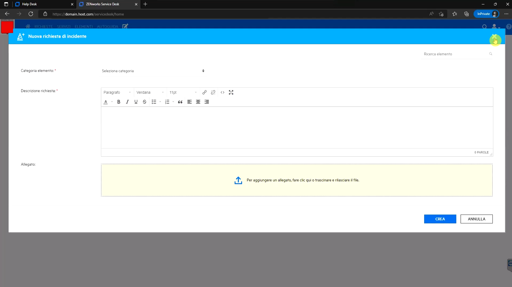

<!--BLOG ABSTRACT-->

Just like private enterprises, government agencies operate web services running vital services that need to be monitored for availability and responsiveness.  Today we'll talk with Gabriele Cecco, who created a visual monitoring test case for a regional government.  We'll get his insights into both some important features, as well as how to diagnose what's going on when you're building a test case and it doesn't work the way you expected.

===

<!--BLOG ARTICLE-->

# Introduction

Private companies aren't the only organizations that need web services.  Governments are also fully on board with both internal and public services over the internet.  Regardless of how local they are, they need their employees distributed across their territory to have fast access to necessary services, while still guaranteeing the privacy of their citizens.

Because these services depend on networks, they can be slowed down or even completely blocked by network problems.  But how can you tell when any one of these hundreds or thousands of services go down?  Even a group of people can't constantly check that all those services are working.  But a software robot can.

Alyvix is just that software robot.  It's a software tool that let's you automate tasks on whatever Windows application you want, by using the same keyboard and mouse.  But it also watches the application interface to see how it reacts, and how long it takes, which makes it perfect for monitoring application availability and performance.

## Quick Review of Visual Monitoring

Here's a screenshot of just such a bot, checking that a single service is running, by clicking on the application's interface just like
a person would.

You can't tell from the screenshot that it's a computer rather than a person using the interface?  Congratulations, the application can't tell the difference either!  And that's the point here:  Alyvix lets you build a bot that runs typical user tasks, and reports back on whether the application is working, as well as how quickly it's working.

(If you'd like to see Alyvix Robot run this test case live, check out the following [video version of this interview](https://youtu.be/d51Sb2EHkoE).)

Now, if you have a lot of users and thus a lot of servers, imagine this bot running not just once a day, but hundreds of times a day, and then lots of other bots also running hundreds of times a day, each one continuously checking that all those web services are also working properly.

Because it runs just like everyday users, then if the bot runs successfully each time, your users are also able to use that app without problems at that time.  This approach to visual monitoring is called automated assessment, and it's a type of
monitoring that checks human tasks rather than the hardware parameters like RAM and CPU that more traditional monitoring checks.

## A Test Case and an Interview

Building a visual monitoring check is what Gabriele Cecco does.  Gabriele implemented a series of test cases for the IT systems of a regional government in Italy.  Each test case checks a specific task on a web server (i.e., a web service), and he then uses a monitoring system to collect the test results and drives a dashboard and alerting system to help that regional government know when it's systems aren't working properly.

I recently interviewed Gabriele to get his experiences and insights about building Alyvix test cases.  Let's see what he had to say.

### Example #1:  Guaranteeing Privacy

**Charles:**  So Gabriele, say you're ready to begin building a new check like this,
what's the first step?

**Gabriele:**  Hi Charles.  Well, protecting privacy is very important, so the first task is usually to log in with credentials in a way where they can't be stolen.

**Charles:**  Okay, here's a quick example, can you explain what we're seeing?

**Gabriele:**  Sure.  So this is the login page of a web portal for a local government, with two text fields to type in the user name and password, and a button to start the login.

Alyvix will type the credentials into the text fields, but they should be encrypted so they can't be seen.

The solution is to use Alyvix to create a publicly visible key where it doesn't matter if someone steals it, because you also need a private key that they don't have.

Then you insert the public keys into Alyvix as if they were the real credentials, and Alyvix decrypts them each time the test case runs, without them ever being visible or even being stored somewhere.

### Example #2:  Diagnosing Your Test Case Failures

**Charles:**  Okay, here's another example, at basically the same point in the test case, that you told me was a bit tricky.

**Gabriele:**  Exactly, so we've told Alyvix what the credentials are, and now we want to show Alyvix where to type them in.  At the start it seems pretty straightforward.

But if you run the test case the way you see it here, the login doesn't work, and the test case fails.  The problem is basically that this is a web portal, so it's built out of HTML and CSS.

The people who implemented this login page decided to add dynamic CSS effects that make these text boxes larger when you click on them.

So the first time I added a selection for the text boxes and used the default region of interest around it.  When it didn't work, I went to the error page to look at the differences between the screen grab in the test case, and the actual screen that Alyvix saw.

If you look, you'll see that some of the selections are marked as matched, while one is marked with an exclamation mark.  That's the first one you should pay attention to, and I saw that the text box was taller than I expected, so the default region of interest just wasn't large enough.

As soon as I extended the region of interest downwards, then the test case worked just as I intended it to.

###  Rest of the Test Case Build

**Charles:**  So you needed to take into account not just the initial screen grab that Alyvix captures, but also any changes that your clicks would have in a dynamic environment as it proceeds through the interactions in a step?

**Gabriele:**  Exactly, and once I did that, it was basically smooth sailing until the end.  The rest of the test case is pretty simple as you can see by how short the script is.

The main task is to log in, click a few times to check that a single page is available within a certain amount of time, and then log out again.

Once you build the test case you can run it once to whether the test case ran successfully from beginning to end, and see how long each step took.

The next step is to collect the results over time, running the test case once every few minutes, to see whether your applications are currently running faster or slower than normal, and when slower, which step is the one causing problems for your users.

## Visual Monitoring Discussion

**Charles:**  So maybe you can tell us something more general, beyond building this one test case. Why does a government agency like this decide that visual monitoring is the right approach for their circumstances?

**Gabriele:**  Well, standard monitoring returns metrics like whether a hard drive is almost full, what the network throughput is, or if CPU load is high.  But it's not directly measuring what users see, it's more like a guess.

But a web app can be down for any number of reasons, like say a service it depends on is down, and that might actually be the reason the monitor thinks there's no problem when there is, because if nobody can use their applications, then the CPU won't be busy and won't raise an alert.

The beauty of visual monitoring is that it sees exactly what a regular user sees, so you don't have to guess or interpret a bunch of numbers.  It tells you right away whether or not people are able to do their jobs, often before they even notice there's a problem themselves.

**Charles:** Thanks Gabriele for giving us an insider's view and some advice on how you build Alyvix test cases.

<iframe width="288" height="162" src="https://www.youtube.com/embed/d51Sb2EHkoE ?color=white&rel=0" frameborder="0" allow="accelerometer; autoplay; encrypted-media; gyroscope; picture-in-picture" allowfullscreen></iframe>
