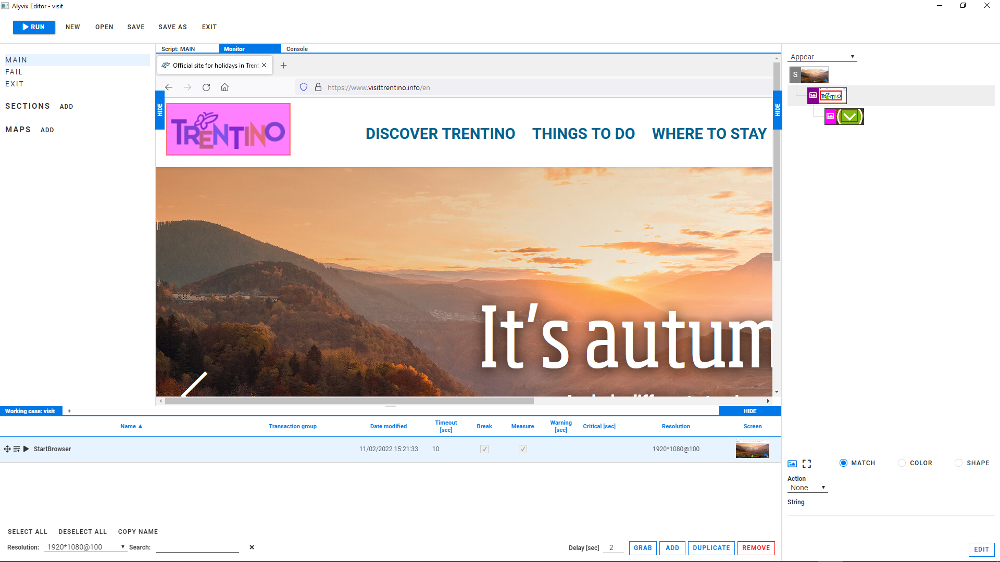

<!--BLOG ABSTRACT-->

These days who has time to check out new software?  You could easily spend half a day figuring things out reading the website.  Well, we've got you covered with our 2 minute video that explains it simply:  what Alyvix is and what Alyvix does.  In fact it takes less time to watch than it does to read this article!

===

<!--BLOG ARTICLE-->

## What Alyvix Is

Put simply, Alyvix lets you automate Windows applications.  That means you could use Alyvix to type data into particular cells of an Excel spreadsheet, pull customer records from your CRM suite, or even navigate a website.

Alyvix has three main facets:

* It sees GUI elements like buttons and images on a Windows screen
* It interacts with those buttons and images just like a person would
* It measures how long the application takes to respond to that interaction

The first two are the heart of Alyvix automation.  It lets you take a task that you typically do, separate it out into a series of recognition and interaction steps, show Alyvix with your mouse how to do each step, and then replay the entire task as many times as you want.

The third part turns Alyvix from an automated bot into a monitoring tool by timing each step down to the millisecond.

## What Alyvix Does

Alyvix Editor is the part of Alyvix that lets you create the interaction steps.  It uses a point-and-click interface that lets you tell Alyvix which areas of the screen need to be present, should be clicked on, or can have information typed in.  In this website example, Alyvix will say "I can recognize this screen" if it can find the logo at the top left and the button to click on at the bottom:

When the automated task actually does run, if Alyvix finds those two elements, it will click on the button and take us to the next task step.

The Alyvix Editor interface is clean and modern, making it easy to show Alyvix the steps in your task:

Alyvix Editor lets you set up the entire task by detailing each step, one after another.  So for a travel reservation website, the steps might be to find the location text box and type in "Venice", click on the "Sort by price" button, select the hotel at the top of the list, insert dates, and confirm the choice.

Since this is the kind of task your users do, and which keeps the purchases on your website coming in, wouldn't it be great to know that it's always working, or if not that your staff can get an alert to immediately get it up and running again?

## Exactly.  What about Monitoring?

If you know how long each step in your task takes from start to finish, you can:

* See when a particular step is slower than you expect it should be
* Check that it's possible to go through a task from start to finish
* By storing the timing data, see whether steps are faster or slower
  than they used to be

Thus you can regularly check that your software and hardware is working properly, plan ahead when you see hardware resources slowly running low, and set thresholds to immediately get notifications and alerts when your systems aren't serving your users they way they expect or need.  You can connect Alyvix output to a graphing system to see exactly how your applications are performing:

And did I mention that Alyvix is open source?  It's hard to beat all of that and "free" at the same time.

<iframe width="288" height="162" src="https://www.youtube.com/embed/YgKcVHH9Hp4?color=white&rel=0" frameborder="0" allow="accelerometer; autoplay; encrypted-media; gyroscope; picture-in-picture" allowfullscreen></iframe>
