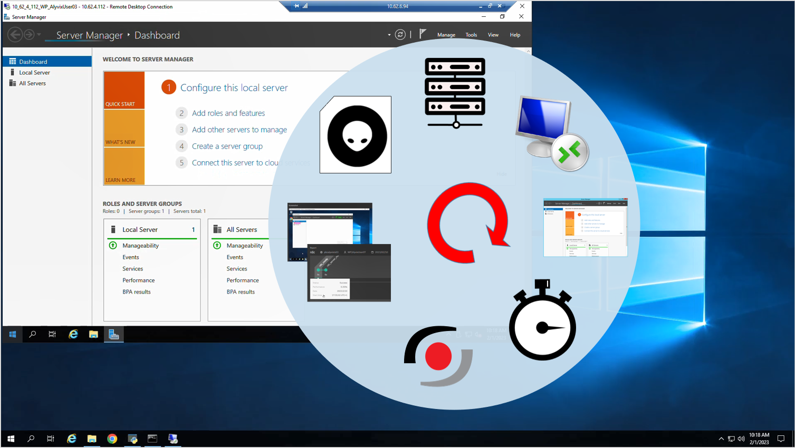

<!--BLOG ABSTRACT-->

Today we take a look at the entire Alyvix Service lifecycle when it's used together with a monitoring system.  We build a complete test case from scratch that uses Remote Desktop (RDC) to log in to a remote server, run an application there, and receive and review reports that include timing data and screenshots of each measured task step.

===

<!--BLOG ARTICLE-->

## Introduction

We recently posted some [videos in our YouTube channel](https://youtu.be/8sH1AWTOQxo) about how you can integrate Alyvix Service with the NetEye monitoring system via the Alyvix Service API.  Here I'd like to look at the complete Alyvix lifecycle when you integrate with any monitoring system, using NetEye as an example.  The plan is to create a full Alyvix test case from scratch, add it to an Alyvix Session on NetEye, and then view a report stored on NetEye .

The test case we'll build is a typical but critical task often seen in business settings:  running an application on a remote machine.  If the ability to quickly and easily do this comes to a halt, your business processes and thus your business will suffer severe problems until the issue can be fixed.

That's the advantage of having Alyvix work with your monitoring system:  Together they'll let you know when things slow down or stop so you can quickly fix the problem.

In today's example, we'll show Alyvix how to use Microsoft's Remote Desktop (RDC) to log in to a remote server and run an application on that server, with the display visible on the local machine.  We'll record the time elapsed at critical points in the process, which will let us know not just whether the process tested is working or not, but if it's taking more time than it should.

From the point of view of the monitoring system, an Alyvix test case is just like any other active check, so it will run the test case on the remote machine repeatedly (say every 5 minutes), report back results, and potentially raise an alert if the test case reports a critical value.

## Test Case Overview

Often remote applications run at the operating system level via programs like Microsoft's RDC.  When an operator needs to access a remote machine to configure something, perform maintenance, change system parameters, or even just run Excel on a virtual machine, they'll start RDC, and launch the desired program from the remote desktop shown on their local machine.  When they're done, they exit both the target program and RDC.

An Alyvix test case needs to reproduce this same behavior:  log in to the remote machine via RDC with its own monitoring credentials, launch and time the remote application, reports back its results, then close the application and RDC, leaving everything just like it was at the beginning.

We're going to build an Alyvix test case to do this by making a script with 7 main steps and 1 extra shutdown step.  Because for RDC you need to type in credentials and confirm by clicking on buttons, logging in just by itself is the first 5 of our 8 steps.

The next two steps will launch and check on our application (I've chosen Server Manager as an example, but it could be any application).  In a production test case with your application in your own environment, you would of course add more steps to test some of its specific functionality and responsiveness at various points that make sense in your particular case.

To get started, switch to your test cases directory (*e.g., C:\Alyvix\testcases\*) and fire up Alyvix Editor.

## Building the Test Case

First, we need Alyvix to launch the RDC application.  Often the best way to launch an application is not to find it in the Start menu or double click on an icon on the Desktop (which someone else might move), but to enter its full path in the Run field.  When we use RDC to launch our application, we can also speed things up by adding an RDP file as an argument within Alyvix, containing parameters like the user ID so that we don't have to add steps in our script to enter all of them one by one.  If you'd like to know more, you can read [Microsoft's documentation](https://learn.microsoft.com/en-us/windows-server/remote/remote-desktop-services/clients/rdp-files).  Many applications have similar shortcuts you can take advantage of, such as the command line options in web browsers that will maximize the browser window when it launches.

After launching the executable, the RDC window will appear.  We want to press the *connect* button on the panel, but we also want to be sure we're pressing the *right* button, so we add nearby components as a reference.  Now that Alyvix can find the connect button, we just have to single click on it to proceed.  After that in the Alyvix interface, we can use the play button to test this second step to make sure it works.  It also has the nice side effect of bringing up the credentials window that we need for the next step.

For our third step Alyvix should find the text box for the password, type it in, and then click on the OK button.  We have to be careful not to use the actual password here, because an Alyvix test case file is *by design* an *open standard* with everything stored in clear text.  So instead we use an encrypted version of the password, which Alyvix will automatically decrypt every time the test case runs.  We've previously [put up a video](https://youtu.be/sAmV1GVX-Y4) that shows you how to create the encryption cypher using the *alyvix_cipher* command.

The next step in the RDC sequence is the window to accept the security certificate. We know the server is on our own internal network, so we can just click on the *Yes* button without further steps.

So far all of these interface steps have been on our local machine, thus they'll always execute almost instantly.  In cases like this, you should unclick the checkbox named *Measure*, which tells Alyvix we don't care how long these steps took.  This helps keep distractions to a minimum when visualizing the results later, because we won't have to wade through a lot of useless data.

Instead the success and speed of this next step is not determined by our local machine, but by the remote machine and the network.  Once the connection is established, the desktop for the specified user and server appears on our local machine.   Any slowdown in the remote machine or network will be reflected in how long it takes for the remote desktop to appear.

So for our fifth and last RDC step we'll tell Alyvix to look for the Start button of the *remote* desktop to let us know it launched successfully.  Then we'll click on it and type "server manager", which will launch the Server Manager application.  And this time we'll leave the Measure box *checked* so that Alyvix will tell us how long it took from the click in the last step until the remote desktop appears on our local screen, which is one of the key performance indicators for any test case involving a remote server scenario.

Since Server Manager is running as a remote application, it will proceed at a typical speed unless there are problems with that machine's resources or the network.  We'll make step number 6 tell us if that's the case by looking for the graphical elements of the Server Manager window, and leaving Measure checked.  Once we can see them, we'll know that Server Manager has been successfully launched.

Together, these are the two most important steps in our monitoring check, because what we really want to know is how long it took the *remote desktop* to appear, and how long it took *our application* to appear.  In a real test case in a production environment, we would now continue adding steps to check other tasks in our target application, but for our example here, we're now ready to close everything down.

It's not enough just to close the application though, we have to make sure *everything* is cleaned up when we're done.  Why?  Because as a monitoring check, we want to repeat this task *over and over*, for instance every 5 minutes.  If something goes wrong, having multiple applications still open will bog down the operating system and create slow response times for actual users, or lead to confusion with multiple application windows all still visible.

To cleanly exit no matter what, we add some steps to the *Fail* and *Exit* sections of the script at the top left.  The Fail script runs if one of our steps above takes longer than the number of seconds we've allowed it in its Timeout field. Our *Fail* script should first kill the application window if it's still there, and then exit RDC itself.  Our *Exit* script runs at the end if no failure occured, so it just needs to exit RDC, which we can do with Alyvix's *kill* argument.

### Running the Test Case

Whenever you create a new test case, you should run it from start to finish several times to be sure it works.  You can run it from the command line using Alyvix Robot, or once it's integrated into a monitoring system like NetEye you can test it from there.  In both cases, you will need to provide the private key that can be used to decrypt the cipher stored in the test case.

## NetEye Integration, Monitoring Data and the Test Case Report

So how did we configure our new Alyvix test case to run in a session on NetEye?

Our [previous](https://youtu.be/8sH1AWTOQxo) [videos](https://youtu.be/ElP_A9XwwpY) describe how to install and configure Alyvix Service and create a Node and Session in NetEye.

So assuming you've followed those videos and now have a working Alyvix Service / NetEye environment, let's add our new Alyvix test case and get it scheduled, which means that NetEye will run it on a regular schedule and gather the results after each run.

In NetEye, go to the Alyvix module, then click on the *Nodes* link.  The Nodes panel will show you the status of all configured sessions on each Node. Make sure the Node you want to run the test case on is currently up.

Now go to the test cases panel by clicking on the *Test Cases* link, and click on the *Create* button to create a new instance of the test case we just built.  You'll need to give it a name, choose the Node it should run on, and select the test case file from the list of all those found in the Node's test case directory.  The Arguments feature is an advanced feature not used in our test case, so ignore it and select *Create*.

Our new test case will now appear in the table, disabled by default.  To schedule it, click on its row to bring up its Sessions panel and then enable the test case for sessions desired by checking the boxes.  It may take a minute for the test c ase to complete, but when it does, Alyvix Service will return the results (timing data, screenshots, etc.) to NetEye.  We can now check how well the remote server and the network are faring.

The easiest way to check this first test case is to look at the first report produced.  So in the same test case panel as before, switch from the Sessions tab to the Reports tab on the test case panel.

Once the first run has finished, we can look at its timing data and the output screenshots.  The timing data for a single test case run is displayed as a timeline at the top, with a point for each step in the test case that has its *Measure* box checked.  Hovering over a point will show additional details.  Clicking on a point will show the screenshots below, one original and one annotated, and clicking on them will expand that screenshot to make it more visible.

## Conclusion

And that's it, we looked at the entire Alyvix lifecycle.  We built an Alyvix test case that logs in to a remote server via RDC with encrypted credentials, and runs an application there.  We then scheduled the test case in a NetEye session, and checked the resulting timing data and reports with screenshots in NetEye.

Be sure to check out our YouTube channel which has the video version of the content in this blog, as well as a number of other videos that can help you learn how to use Alyvix and Alyvix Service.

<iframe width="288" height="162" src="https://www.youtube.com/embed/C3GiaQoyhCQ?color=white&rel=0" frameborder="0" allow="accelerometer; autoplay; encrypted-media; gyroscope; picture-in-picture" allowfullscreen></iframe>
