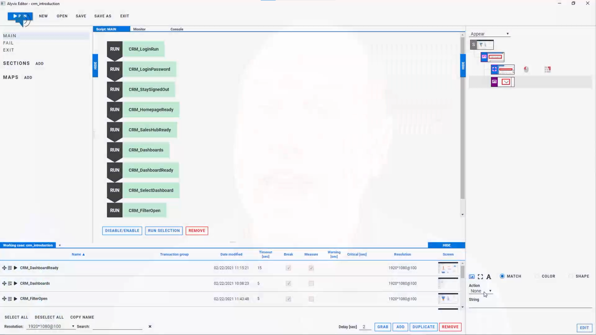

<!--BLOG ABSTRACT-->

Visual monitoring is an exciting complement to traditional monitoring that allows for full, end-to-end monitoring.  Beyond monitoring just your hardware, it checks that your apps and services are always as responsive as your users and customers expect them to be.  Alyvix Service and Alyvix work together to monitor your apps, delivering reports and historical data that you can use to both diagnose specific problems with your apps, and to help foresee IT problems before they affect your users.  Let's see how.

===

<!--BLOG ARTICLE-->

Do you work in IT?  And by that, I mean down there in the nuts and bolts of IT. If you do, I bet you know what **monitoring** is.

It's how we keep our systems up and running *all* the time.  After all, it's not like your average IT company has a small army of people doing nothing but checking 24/7 that all their hardware and software is working.  With your monitoring system you usually add checks and alerts so you can find out when your devices have problems and instantly restart any device that goes down.

But that's your hardware.  What if your hardware's doing fine, but your apps or services seem to keep going down anyway?  How is CPU load going to tell you if for example Microsoft's Dynamics 365 displays your existing orders, but stops taking new ones?

## Visual Monitoring

That's what **visual monitoring** is for.  A visual monitoring system like Alyvix and Alyvix Service runs its checks against the graphical user interface of a computer rather than checking its hardware.  And so it can tell you when something critical that your users or customers *need* isn't working.  And what's even better is that it can tell you before they even notice any problems.

You see, visual monitoring doesn't repeatedly ask your hardware how it's doing like regular monitoring does.  Instead, you create what's called a **bot**, which pretends it's one of your users, someone who's trying to run one of your critical tasks.  Basically, the kind of business services you need to ensure your business remains successful.

## Alyvix and Alyvix Service

So what do I mean when I say "Alyvix runs your critical tasks"?  Well, at the beginning you show it how a person goes through that very task: what they look for, what they click on, and what they type in, for each step in the interface.  You can think of setting up Alyvix kind of like you would teach a trainee employee to do that same critical task.

But rather than a trainee you'll have an Alyvix software bot that will run through the task all by itself, making sure each step works, and pressing buttons to go on to the next step, until the task is done.  And it does that task over and over, every 2 minutes, 3 minutes 5 minutes, whatever interval you think is right.

And with Alyvix Service, you can set your own schedule for your Alyvix bot.  Run it often on workdays, less on weekends if you want.  It's really flexible.  And then get the results sent for display, like in a monitoring system's analysis window.  But more on that in a bit.

We usually call the bot for a particular task a **test case** (i.e., it *tests* whether a task is working), and we talk about Alyvix Service **scheduling** one or more test cases to run at certain times on certain computers.

## Building Your Bot

The first step in the whole process is to build that bot (or test case).  You'll need to break down *your* critical task into a set of steps, where the idea is that if your bot can do each step at a particular time, then your users can also do that same task.  Alternately, if the bot can't do a particular step (say, the DB is thrashing), your users will get hung up at the same point.  Because after all, it's the exact same interface on the exact same machine, doing the same tasks that users do.

Let's say your app is Microsoft's Dynamics 365.  Then the steps for one of your critical tasks might be logging in, finding an account, adding a new purchase order, and logging out.  If you think that's not enough, just add more steps.  When building your bot, you use the free **Alyvix Editor** to define each step:  show it which graphical elements to look for, what buttons or text fields to click on, and what text to type in.

Editor is like a GUI for your GUI, where you can create or edit a screenshot for each task step, and mark it up with your mouse.  When the bot runs, it compares what's currently on the computer screen against your marked up screenshot for that task step.  That's why we call it **Visual** monitoring:  Alyvix "looks" at the screen to make sure your app is responding properly, which is exactly what people do.

Next you tell Alyvix what's the longest time each step should take.  That's where our warning and critical will come from:  When you run Alyvix with Alyvix Service, the latter will forward the data to your existing monitoring system, so you can set up any notifications or alerts you like.  For instance, if the login step takes more than 10 seconds, send an alert to your IT admin!

Once you've built your bot, check it once by hand with **Alyvix Robot** (Editor builds test cases, Robot runs them) to be sure it works.  You can watch it run your steps on your actual software interface.  It can tell if the app isn't responding (known as *availability*), or how fast it's running (the *performance* of each step), and Alyvix Service can relay that data to your monitoring system about the problem right away.

## Test Case Configuration

Now we get to the fun part (at least as far as IT admins are concerned).  Go to your monitoring system that has Alyvix Service integrated.  In the examples below I'll use NetEye, but any monitoring system that works with Alyvix Service is fine.

Alyvix Service is the scheduler that runs your bot however often you want.  The configuration steps are explained in the documentation and several of our videos, so for now I'll assume you've set up a target system (called a **Node**) and configured one or more **Sessions** on it (sessions let you run more than one test case in series at a single scheduled time).

Adding the test case itself is easy, you just copy it to the correct directory, then in the Alyvix Service section of your monitoring system choose a node and session and click the check mark next to your new test case.  Now's also when you can set your session to run at whatever interval you prefer.  And you're done!

(If that's too fast for you, feel free to create another test case and add it to your session as well.)

All that's left is to wait while Alyvix Service schedules our bot.  I mean test case.  Whatever.  You know, you can do a lot in just a few minutes.  Drink some coffee?  Ask about your retirement benefits?  Maybe do a quick workout at your desk?

## Reports

Right, we were talking about results...  Usually what you will see in monitoring systems are two options:  Reports (which may even be in easily-printed PDF format) and Graphs.  After waiting 4 minutes plus however long the test case's run time is, let's take a look at a report first.  The most important thing a report should tell us is:  was the bot able to successfully run the test case to completion?  Reports usually show a large green indicator for a successful run, and a red one for a failed run.  The NetEye monitoring system we used to make our video is no exception:

So what can a single report tell us?  Well, you can think of a report as a snapshot in time of how a single test case ran.  In the example above everything worked, and we can immediately see not just the overall success, but also whether each of the steps in our test case worked properly, and how long they took.  In other words, each individual task step worked within the time limit we set when we built the bot.  Alyvix Service also records a screenshot for each step, which you can see by clicking on one of the step results.

Of course, typically we're more interested in what happens when one of the steps didn't work.  In this case the report shows you exactly which step exceeded its time limit, and clicking on it shows both the actual screenshot as before, side by side with what Alyvix expected to see.  It's not just a useful tool for you if you need to diagnose something, it's also proof you can use if for instance you have an SLA because your service is managed by someone else.

## Interactive Graphing

Reports are great, but what if you want to quickly investigate the details of a failed event that happened sometime yesterday, or you want to see what the trends are to help you adjust your system to meet future demands?  That's when you want to collect test case runs over time and dig into the analytics.  Alyvix Service takes care of sending all that data to your monitoring system.

If your monitoring system is like NetEye which includes Grafana, you can drill down into the graphs interactively.  If you've never scrolled through and selected subranges of graphs by time, it almost feels like magic the first time.  Just to take a few examples, you can see:

* When response times are worst, like time of day or day of week
* When something is getting progressively slower
* When everything went down
* Which task steps took longer than usual

It becomes even more powerful when you can correlate slowdowns in what your users experience with more traditional monitoring measures like CPU load and network throughput.  By comparing the two, you may be able to find the root cause of degraded experiences like really slow logins or user requests that don't return results.

## What Monitoring Would Your Users Prefer?

Any monitoring system will tell you how hardware factors like CPU load are doing.  But if you want to know whether **your apps** and **your services** are doing what your users and customers need, at any moment, you need something beyond that: **Visual Monitoring**.  Or better yet, combine the two and holistically monitor your entire IT infrastructure.

Be sure to check out our YouTube channel which has the video version of this article, as well as a number of other videos that can help you learn how to use Alyvix and Alyvix Service.

<iframe width="288" height="162" src="https://www.youtube.com/embed/aTyxldL7pN4?color=white&rel=0" frameborder="0" allow="accelerometer; autoplay; encrypted-media; gyroscope; picture-in-picture" allowfullscreen></iframe>

