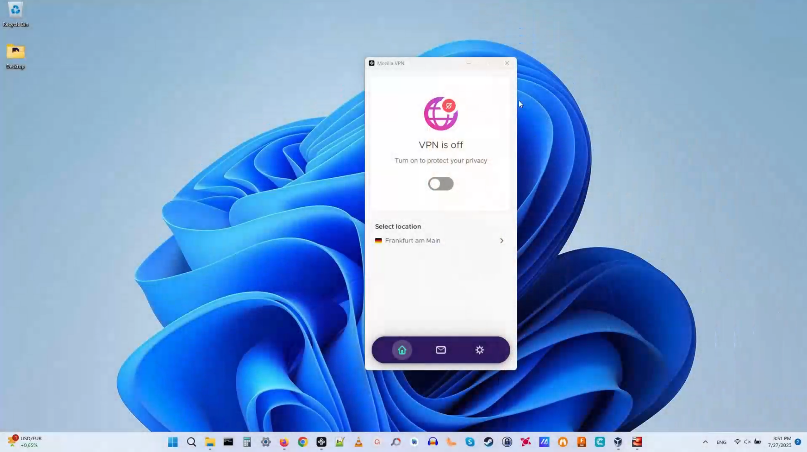
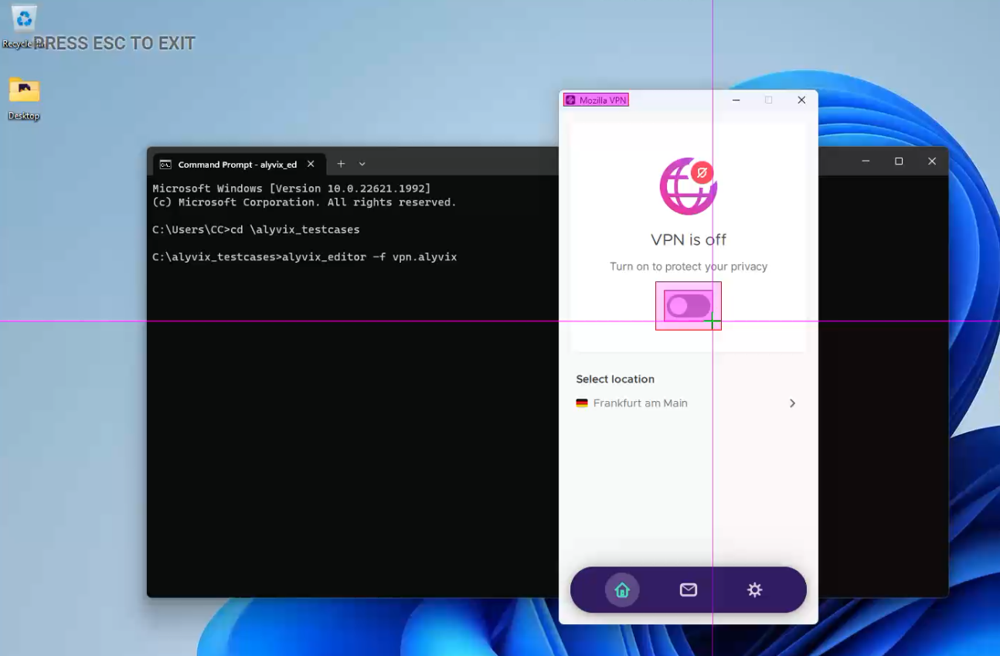
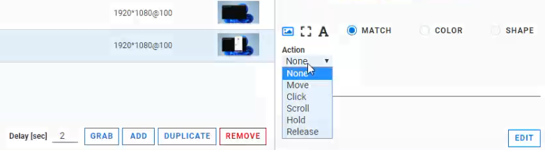
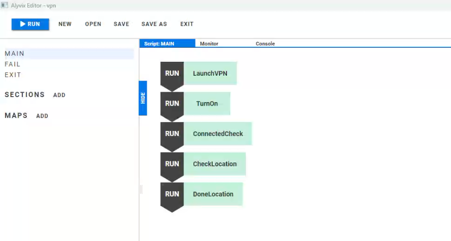
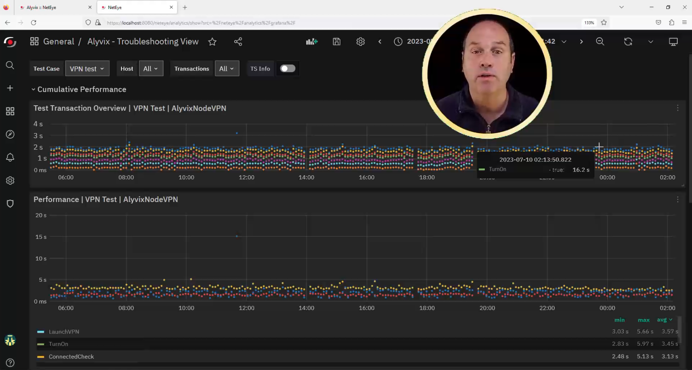

<!--BLOG ABSTRACT-->

Office, Home Office, what about Beach Office?  It doesn't matter how remote
your workers are, they need to be able to connect securely to the Main Office
so they can access all their files and data as if they were in the Office.
And VPNs are the main way this gets down.

As an IT administrator, how can you ensure that the VPN server is always
up so people can get their work done?  Use Alyvix and Alyvix Service to
continually check the state of your VPN from **outside** your company,
where your remote workers are.  Read on to see how.

===

<!--BLOG ARTICLE-->

## Timely, Secure Remote Connections

Imagine you're in "Beach Office".  It's like home office: working regular
hours in a lounge chair with WiFi from the nearby beach bar.  Nice and
relaxing, isn't it?  And nice of your company to let you work remotely
several days a week.

You settle down at the same time as everyone else is arriving at the office,
and just like working remotely at home, you fire up your VPN to connect.

Only, it doesn't connect.  Your WiFi is fine, and you can see your company's
web site, but no VPN.

A VPN doesn't just give you a secure connection, it lets you see all your
computing and network resources almost as if you were physically at work.
So when it's down, it's almost as though you aren't really working.  The
firewall isn't going to reply "Okay, just this once."

## Monitoring Your Hardware vs. Monitoring Your Applications

Now imagine yourself as an IT administrator who has to manage the VPN
server along with all the other company infrastructure.  Just think
how bad it would be if all of your remote workers can't connect through
the VPN.

Now, you already have internal monitoring checks to tell you if the VPN
server goes down for whatever reason.  There's still a problem, though.

Those checks are from *inside* your company, but your remote workers aren't.
So you can't just check the hardware and operating system: users don't see
hardware or software infrastructure. They see their **applications** and
their **services**.

You need something that looks at apps from an external user's point of view,
but that you can still use just like any other monitoring check.

## Visual Monitoring and Alyvix

So here's an idea:  go beyond traditional montoring checks and give
**visual monitoring** a try.  A visual monitoring system like Alyvix
uses the GUI itself as a monitoring check, pointing, clicking and
typing just like real people do.

So if a user clicks on the "VPN connect" button and nothing happens, then
visual monitoring will *also* click on the exact same button and see
*nothing happening*.  That's when an alert is raised and you fix it,
often before any real users even notice.

And just like any monitoring check, Alyvix really shines when you ask it
to check the exact same critical task a thousand times a day.  So stop
treating your colleagues as guinea pigs, for VPN access or any user-facing
software or service.

## Users and VPNs

Let's quickly review how a typical VPN client works from the user's point
of view. Here I've got MozillaVPN installed on Windows.

Basically when you want to turn on almost any VPN, you click on the VPN
icon in the task bar or system tray, move the mouse to the "ON" button,
and press it. Depending on your IT department's policy, you may also have
to type in your password.  And that's it, pretty easy.  When you're done,
you do the same sequence, but clicking on the "OFF" button.

But that's how a real person does it, it's **not** how a traditional
monitoring system check does it, which is to run a system command, or make
an API call to code in a browser or application.  If no answer comes back,
then something must be wrong.

And here's the major difference between traditional monitoring and visual
monitoring like Alyvix:  Alyvix works the same way that people do.  It runs
through tasks just like people do, by locating text fields, typing in
passwords and clicking buttons.

## Implementing Visual Monitoring

So how can you set up visual monitoring for *you*?  Well, just like typical
monitoring you'll want to run a check that measures every few minutes whether
an application responds appropriately to user input.  In the case of our VPN,
this means checking whether a remote person can actually connect via VPN,
and whether it takes a lot longer than it usually does.

To do that we'll create something we call a *software bot* that simulates
a user.  This bot will run through the user's steps and then tell us the
results.  These results can also be used to automatically trigger alerts
in your existing monitoring system.

In fact Alyvix helps us easily create any number of software bots.  Each
one we call a *test case*, which corresponds to a single monitoring check
that's intended to be run repeatedly every few minutes.

To create our test case we run a program on Windows called
*Alyvix Editor*.  If later you find you made a mistake when Building
your test case, you can just fix it any time in Alyvix Editor again.

You can then run your test case once using another program called
*Alyvix Robot*, say if you want to make sure that it works before
you turn it loose to run every few minutes.  Once it's perfect, you
then add the test case to your monitoring system just like any other
check, where you can run it however often you like.  

### Building a VPN Test Case

So let's look at how to use Alyvix Editor to repeat each of the user's steps.
To see what the user should see, we make a copy of the screen.  In fact,
we'll make a series of screen captures, because that's where the *visual*
part of visual monitoring comes from.

For each of those screens we use the mouse to show Alyvix how to interactive
with the graphical elements there:  how to find the MozillaVPN icon and double
click on it, how to find and click on the Connect button in the MozillaVPN
window, etc.

Let's look at a specific example.  Say the user has to click on the Connect
button.  How do we tell Alyvix how to do that same action?  First, it needs
to know what to look for and approximately where to find it.

The problem is that windows don't always pop up in the same place.  It could
be anywhere onscreen.  So after we grab the screen we draw a rectangle
representing a unique graphical element, like the VPN logo, to serve as an
anchor.

We then identify additional interaction areas (buttons, text fields, etc.)
by putting additional rectangles over each one on the screen grab.  Then for
each one, we tell Alyvix exactly how to interact with it, whether it's to
click a button, type text into a box, select a text range, or drag an icon,
or some combination of those.

In our case, our anchor will be the Mozilla VPN logo at the top left of the
window, and the large Connect button in the middle of that window.  We don't
need any action to recognize the logo, just a Click action which by default
will take place in the center of the second rectangle, resulting in a mouse
click on the associated button.

So after we build and sequence the set of action steps needed to perform the
user task, our software bot can launch and connect via VPN.  Is that enough?
Of course not.  We also want to know  whether it worked, and how well did
it work, for instance was it fast enough?

To do that, we add a step that doesn't *do* anything like type or click,
it just looks at whether the VPN's success message popped up. If we can see
the message appeared, then we'll know the VPN is connected.  We can also
use Alyvix to time how long it took from the previous click to when the
message appeared, and report that to an integrated monitoring system.
 
And last we also need to to disconnect from the VPN. After all, if we want
to run our software bot over and over again 24/7, we'd better disconnect
each time or else our first step won't see that initial "Connect" button
when it runs the following time.

When we're done, we'll even see the ordered sequence of steps that makes up
the entire test case.  And the names we give each step are the same names
that are sent to an integrated monitoring system or IT dashboard.

### Using Your Test Case

Oh by the way, did we talk about writing any code when we built our software
bot above?  Any APIs?  No, we just used the existing Windows GUI to make
screen captures, and tell the mouse and keyboard what to do.

But how is a working test case going to help you with your VPN software?
After all, you don't know ahead of time when something is going to fail.

The solution is to run your new software bot at regular intervals,
all day long.  *One* of those robot runs is just going to happen to be a
few minutes before you need to log on, plenty of time for the sysadmins
to get the alert and restart the VPN server.  Odds are you won't even
*notice* it ever went down.

And that means of course that your IT Team will get all of their
well-deserved lack of attention that everything is always working great.

### Trends, Historical Data and Reports

Especially if they've completely automated everything so that the VPN
server restarts without IT noticing either.  But what if IT wants to figure
out *why* it went down.  Who knows how long that could take, right?

Well, not much time at all if we record the results every time our robot
runs.  Then IT can look at the historical data and trends whenever they
want -- it's always available.  And since you ran your check every few
minutes, you can pinpoint every time it did go down.

How?  Alyvix works with Alyvix Service to record the results of every robot
run, and if you integrate it with a monitoring system like the one shown
here, you can drill down with interactive graphs like these, and even
correlate your Alyvix checks with other monitored data.

You can even see exactly what your bot saw, because Alyvix Service saves
screenshots at each step, and automatically creates reports for you with
both the screenshots and timing data.  You'll *know* every time the VPN
server went down, and for how long.

## Comfy Beach Offices

So your users may not notice it as they sit at the beach sipping their
lattes, but there's an entire bit of infrastructure devoted to making sure
they can do just that.

And if that infrastructure includes Alyvix and Alyvix Service, you won't be
limited to just checking that your local hardware and software systems are
working, and you won't need to hire a programmer to write API interfaces into
every one of the software products you use.

<iframe width="288" height="162" src="https://www.youtube.com/embed/9LZPbx8FNxU?color=white&rel=0" frameborder="0" allow="accelerometer; autoplay; encrypted-media; gyroscope; picture-in-picture" allowfullscreen></iframe>

