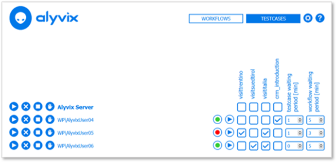
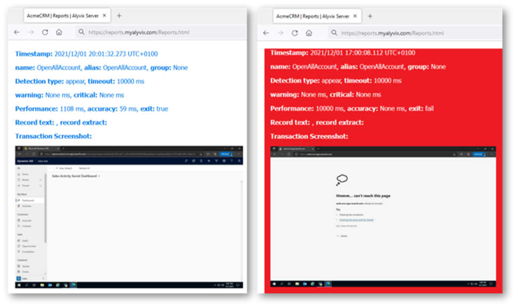

  
<!--BLOG ABSTRACT-->

Alyvix Server and previous versions have helped us
create a usable visual monitoring system focused not
just on individual checks, but orchestrating groups
of checks to regularly monitor multiple, distributed
applications.

With the introduction of Alyvix Service, that task
has become even easier.  Why is that, and why should
you migrate from Alyvix Server to Alyvix Service?
Read on to find out!

===

<!--BLOG ARTICLE-->

## Introduction

Alyvix Service is a great way to regularly monitor
the performance of your critical applications.  And
the latest versions of Alyvix Service have some
really great features.

But Alyvix Service didn't just come out of nowhere.
For almost a decade we've been on a long evolutionary
path to get here.

So today I want to show you how we've improved visual
monitoring with Alyvix over time, why you should keep
up with the latest features, and the simple steps
needed to migrate from Alyvix Server to Alyvix Service.

## The Early Days of Alyvix

In the beginning (we're talking the 1990's here) there
were simple monitoring systems, and most were based on
**Nagios**.

Nagios was so early and thus influential that even
if you wanted to build your *own* monitoring system,
you would still follow the Nagios protocols so you
could also use all of its many, many community plugins.

Our first version of the nuts and bolts of visual
monitoring with Alyvix, let's call it *Alyvix Check*,
was no exception:  we wrote a simple command check for
NetEye 3 that used Nagios format to call
[NSClient++](https://nsclient.org/) on a Windows machine.

But configuring anything this way except the simplest
workflow of Alyvix test cases was slow and difficult,
and it scaled badly for both multiple agents and
complex applications.

There were also a number of missing features, like
on-demand report generation and scheduling across
multiple servers.

### And Then Alyvix Server

And that leads us to the next evolutionary step of
Alyvix and visual monitoring: Alyvix Server, a
standalone webapp enabling complex visual monitoring
workflow tests to measure application performance.

Paired with a modernized version of the core Alyvix
software, Alyvix Server expanded from running
single test cases to running **sessions**, where
multiple test cases could be scheduled together.

Alyvix Server ensures those sessions run on time,
and that the connections between Windows machines
remain alive.

As each test case runs in its session, Alyvix
Server also collects the data they generate,
stores it, and makes it available over a modern,
REST-based API with a well-documented interface.

Finally, Alyvix Server introduced visual reports
created from that collected data, allowing you
to see dashboards and graphs, and compare
side-by-side screenshots of the expected versus
the actual results.

But Alyvix Server isn't perfect:  it's missing
full authentication and didn't include a
permissions-based authorization system. In addition,
nodes still had to be configured and accessed
one by one, not the most scalable solution.

### Alyvix Service

While Alyvix Server was a huge step forward for
orchestrating large numbers of test cases over
multiple machines, so was the next evolutionary
step: Alyvix Service, which addressed several
limitations of Server.

First, with Server there was almost an attempt at
re-inventing the wheel with the latest visualization
technologies, since many monitoring systems already
include sophisticated software for displaying
complex graphs of monitoring data
like [Grafana](https://grafana.com).

And IT administrators don't like duplication --
it leads to overloaded system resources, more
software updates, and a greater potential for
security holes.

So instead, Alyvix Service doesn't include its own
front end.  Rather, it's a module that can be
integrated into any monitoring system using its
[RESTful API](https://alyvix.com/learn/service/full_restful_api.html),
taking advantage of the host monitoring system's
visualization system for displaying both
monitoring data and reports.

Second, Alyvix Service has no graphical configuration
interface, which is now also managed via RESTful API.
This is important for monitoring systems which want
to keep a unified graphical interface for their users:
it lets Alyvix Service handle the logic while the
host can use the navigation and display styles its
users are used to.

Third, Alyvix Service has a number of invisible,
infrastructure improvements including a more
robust internal database, the use of efficient
protocols like NATS, and significantly increased
security, letting you put it on systems with
access to the internet.

And finally, Alyvix Service has come full circle
to the old Nagios days, now supporting those same
individual monitoring checks for special cases,
while still letting you orchestrate the large-scale
monitoring of complex applications.

## Migrating to Alyvix Service

So I hope I've showed you that *Alyvix Service* is
superior to *Alyvix Server* and, of course, to
Alyvix as just an ad-hoc integrated check.

Well then, why *wouldn't* you migrate?

### The Reasons

Consider first that Alyvix Service is under
active development, while Alyvix Server has been
deprecated.  That means Server won't receive any
more bug fixes or security updates, and no new
features will be added.

And this can be really important in an enterprise
environment. For example, Alyvix Server was
restricted to operating over protected networks
because its API wasn't fully secure.

Alyvix Server also scales poorly as the number of
Alyvix nodes increases, because you have to log in
separately to manage each node.  With Alyvix Service
you can control nodes from a central point,
namely the monitoring system it's integrated into,
saving you a lot of maintenance time and effort.

For managed service providers, the **multitenant**
capabilities of Alyvix Service let you deploy
visual monitoring for all your clients at once,
while keeping them independent from each other.

And rather than being a separate webapp, Alyvix
Service is completely integrated into the host
monitoring system.  You won't even notice when
you switch back and forth between them.

And finally, migration is a simple and easy process.
Switching from Alyvix Server to Alyvix Service takes
at most an hour, and most of that time is bringing
security in line with modern standards.  You don't
even have to worry about your existing Alyvix test
cases, they can be left **exactly** as they are.

## Let's Do This

So I hope I've convinced you that now is the time
to migrate to Alyvix Service.

Well now you're faced with the next question:
**How** do I migrate?

The process in a nutshell is basically to uninstall
Alyvix Server, install Alyvix Service, and then
configure Alyvix Service in the new monitoring system.
Let's look at each step in more detail.

### Uninstalling Alyvix Server

To uninstall Alyvix Server you'll need to:

1. Back up any security certificates currently in use
   at *C:\Program Files\Alyvix\Alyvix Server\cert\*
2. Stop Alyvix Server within Windows Services
3. Uninstall Alyvix Server in Windows Apps Settings
   and then remove the Server directory
   

### Install Alyvix Service

Next, you'll need to install Alyvix Service on
EACH Windows Server machine that will actually
run your test cases.  Those steps are listed in
Alyvix Service's
[standard installation instructions](https://alyvix.com/learn/service/install.html):

1. Request a license
2. Upgrade (rather than install) Alyvix core
   as [described here](https://alyvix.com/learn/getting_started/install.html#upgrading-alyvix)
3. Install PostgreSQL
4. Install Alyvix Service, including configuring
   the security certificates to communicate with
   the browser and monitoring system
5. Start Alyvix Service in Windows Services

From there you'll need to go to the Alyvix
interface in your monitoring system and follow
the specific instructions for that system to set up
the Alyvix nodes, the session workflows, and the test
case path.

Once configured, all that's left is to activate your
sessions which will launch your test cases.  Did I
mention you don't have to change your test cases
at all?

## Conclusion

And that's it, a quick history of using Alyvix to
implement visual monitoring, and the why and how
of upgrading to the latest version, Alyvix Service.

It's time to migrate!

<iframe width="288" height="162" src="https://www.youtube.com/embed/Sfjq4jG1FjE?color=white&rel=0" frameborder="0" allow="accelerometer; autoplay; encrypted-media; gyroscope; picture-in-picture" allowfullscreen></iframe>

   
Header photo by <a href="https://unsplash.com/@rayhennessy?utm_source=unsplash&utm_medium=referral&utm_content=creditCopyText">Ray Hennessy</a> on <a href="https://unsplash.com/photos/flock-of-white-bird-flying-during-daytime-YtOEJTfDWZc?utm_source=unsplash&utm_medium=referral&utm_content=creditCopyText">Unsplash</a>
