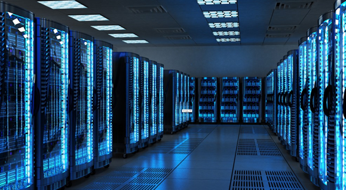
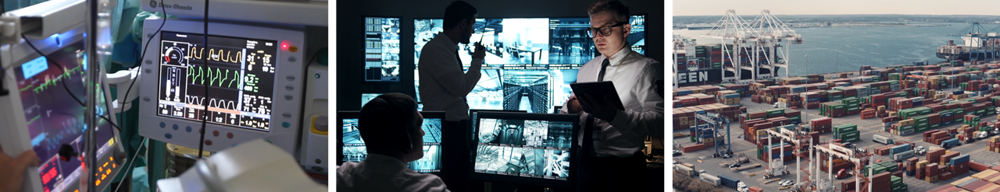
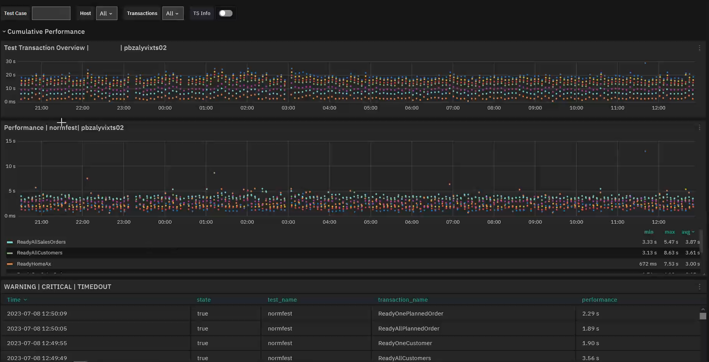

<!--BLOG ABSTRACT-->

Of course you could run your critical IT and business systems without any way to know whether they're currently running or not.  In modern business if 'critical' doesn't mean 'needs to be working 24/7', what does it mean? Read on to find out why you need to monitor your critical systems, the main approaches to monitoring, and the benefits of monitoring once you've set it in motion.

===

<!--BLOG ARTICLE-->

## Why is system monitoring vital?

Not every computer is up and running 24/7.  Most laptops for example are only turned on while they're being used.  What would happen if some important program stopped working?

Well, since most likely there would be someone sitting right in front of it using it, they'd obviously notice if the program they were using crashed, or the battery was about to die.

If that happened, the worst case is you'd have to reboot that laptop, or recover a few files.  You wouldn't really need to do anything special to check that it's currently working or not: you're sitting in front of it, so you can just look at the screen.

Imagine instead though we're not talking laptops or PCs, but about servers, virtual machines, or a set of web services.  These are business-critical systems, probably either somewhere in a room in the back or in the cloud, and almost assuredly without a physical screen or keyboard for someone to sit in front of.

And imagine this system isn't running PowerPoint or browsing the web.  Instead it's the server for an e-commerce site that grosses $2 million dollars a week.  Systems like that don't even have to go down completely to cause problems; slowdowns or increased waiting times can decrease the productivity of every user or the services' usefulness for customers, making them decide to go somewhere else.

But imagine for a moment that it does go down. To restore everything we're not talking a 2 minute reboot, or loading a couple of files from backup.  It's a huge difference: in this case recovery is going to be critical and complex, and it'll take a while to restore everything properly.  We really need to know the moment a critical system goes down, to help us minimize that downtime and thus minimize how much money you might lose because of it.

It doesn't even have to be for sales.  It could be a computer checking hospital patient vital signs, servers handling internet access for an entire city, logistics systems that need to get packages out the next day, or just lots of average users, including your own employees, who can't log in to run their remote applications.  If the task is critical, whether financially or for some other reason, you need IT monitoring to ensure important systems are working all the time.

## What ways can I monitor my IT systems?

The simplest solution to knowing when your apps or systems fail is just to have someone sit there checking one computer after another, over and over.  Think of it as the Industrial Revolution approach, where you had factories full of hundreds or thousands of people watching over machines.  But this approach is expensive: you'd need to hire someone to watch several computers each.  And that's not to mention the soul-crushing nature of that work for those people.

A much better solution is automatic system monitoring, where you let computers do what they're good at: soul-crushing, repetitive action.  Here each monitor (itself a server or VM) checks a large group of servers or VMs that are doing the real work, asking each one every few minutes how they're doing.  The monitor asks two things of each server:  (1) are you running right now, and (2) how fast things are going.

The monitor then does two things with this information:  (1) immediately send out alerts and notifications so that a system administrator can intervene to restore the affected systems, and (2) save the answers in a database so the sysadmins can use it later to try to resolve problems (say, restart a downed server, or allocate more servers to handle a peak load) or see trends that can help prevent those problems from happening again.

Each monitor consists of a single physical or virtual machine running the monitoring software itself, and software on the working servers (the subject of our follow-on blog post).  As your business grows, and thus the number of working servers grows, you can easily scale up by adding more monitors.  The monitoring system will usually include dashboards and other utilities to help you organize and visualize the data it collects.

## Making use of monitoring

As we saw above, a monitoring system can send out alerts and notifications when a system goes down.  In reality though, unscheduled downtime may not always be your biggest problem.  If you frequently have slowdowns and high latency, they may not have the immediate critical impact that downtime does, but the cumulative effects over time can be even greater.  In this case the dashboards that let you explore trends and historical data may be more helpful than alerts and notifications.

In addition to slowdowns and latency, exploring data trends can help you discover ahead of time that a hardware failure may be about to happen, for instance by seeing progressively increasing problems indicating that a hard drive is starting to fail, or by seeing that network loads are steadily increasing and while a network switch can handle it now, it probably won't be able to in a month.

If you can get that heads up, you'll have time to intervene *before* anything bad happens, by speeding up hardware maintenance or up purchasing decisions.  And with the data from monitoring, you'll know exactly where to begin looking for the cause.

That's why you need monitoring, both to keep things running smoothly, and to be warned the moment that stops.  In this series on the monitoring basics, we'll look next at how you can actually go about monitoring computers.

<iframe width="288" height="162" src="https://www.youtube.com/embed/TzdrJvhyZ8g?color=white&rel=0" frameborder="0" allow="accelerometer; autoplay; encrypted-media; gyroscope; picture-in-picture" allowfullscreen></iframe>
