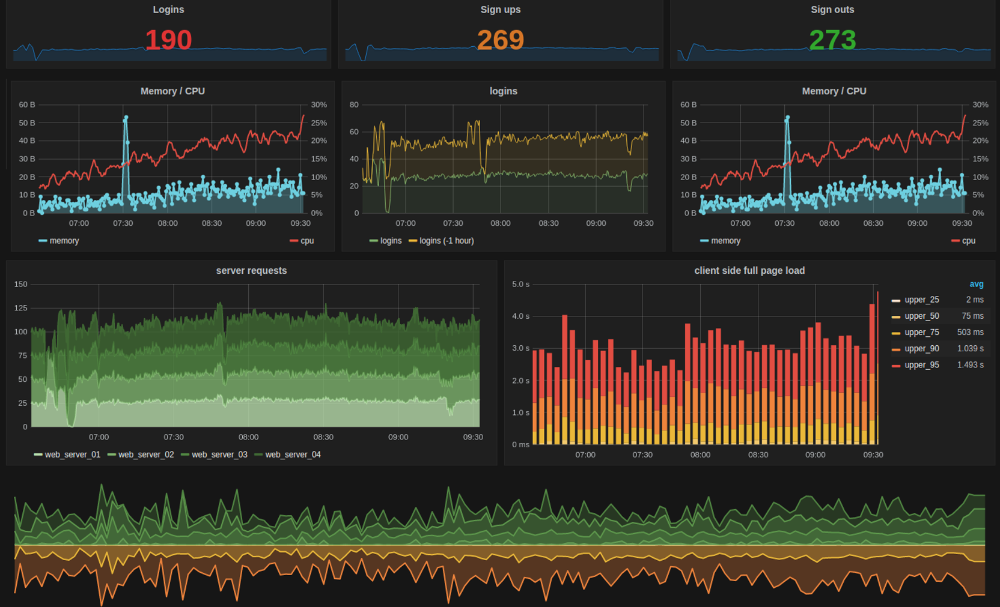
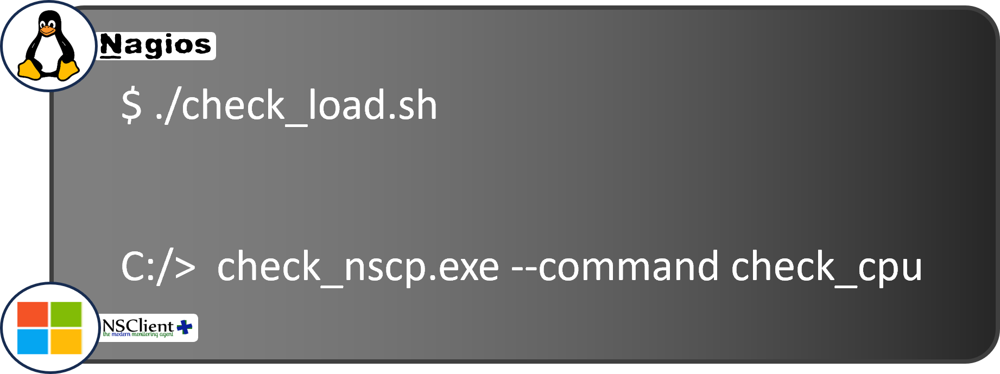
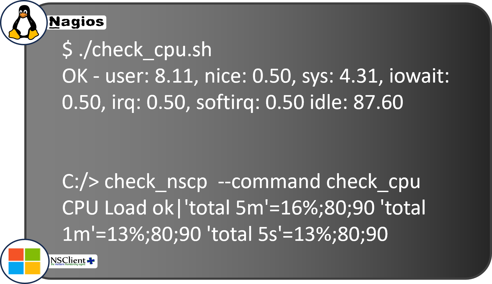
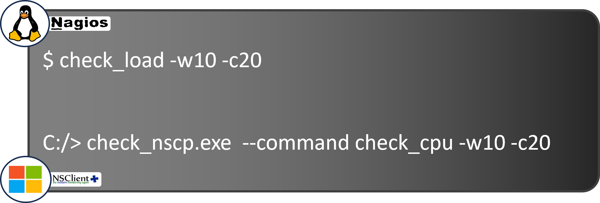

<!--BLOG ABSTRACT-->

Computer software doesn't work 100% of the time.  When it doesn't, you need system monitoring to discover it, help IT administrators locate and fix the problem, and plan to help prevent future failures.

To configure a monitoring system you need to understand how it works, like agent-based versus agentless interfaces, and active, passive and synthetic strategies. We'll see how the monitor launches checks, how results are reported back, and how those results are interpreted.

===

<!--BLOG ARTICLE-->

We've already look in depth at [why you should monitor your IT systems](https://alyvix.com/blog/20240315_monitoring_basics_01).  Here we'll look at the what and how.

# What Exactly Do IT Monitoring Systems Do?

So what does it mean to monitor your systems? Fundamentally it involves three basic things:  the computers you want to monitor, a separate computer to monitor them with, and the network connecting them.

If you need to check on just a handful of servers, you can do that with a single monitor.  But if you have a large business, you'll need multiple monitors working *together* as you scale up.

But let's start with the simplest case: one server being monitored, and another doing the monitoring.  The first one is doing all of the actual work:  displaying products, processing sales, calculating flight plans, whatever it might be.

### Deciding if a Computer is Up or Down

When connected, these two computers can already carry out the most basic kind of monitoring using the *ping* command, where one computer sends a message to the second computer on the network and waits to hear a "Hello" back.  Our *monitor* is the one that says "Hello" first.

If an answer comes back, then we set the status to "Up" for that computer.  If there's no reply, it indicates there's a problem somewhere, like the server is down or overloaded, the network is down or congested, and so on, and it should be set to the "Down" status.

### Using Latency to Measure State

You can also look at how *long* it takes to send and receive those messages.  Just one answer might not tell you much, but half a second is considered really slow, since we expect the response back in milliseconds, not seconds.

So how do we know if a number we get back is good or not?  Well, we can look at *past* round trip times to see if this one was slower, average or faster than usual.

And if we don't get any answer back?  How long should we wait before giving up on a target server that may be down?  We don't want to wait forever, so we have to set *some* limit.

Actually, we can set several of these limits, say a short *warning* time to just log the delay, a bit longer to send a *critical* dashboard alert, and an even longer *timeout* number that says someone needs to fix it **now**.

### What Do We Do with the Results?

And what can we do when a timeout indicates something really went wrong?  While we could show an alert to the user, most often we want to tell someone who can *do something* about it:  the IT support staff.

So for each type of problem we'll need to know both who should be notified, and the various ways we can contact that person, such as an email address if there's no hurry, a DM account if there is, or a phone number if it's urgent.

The monitor saves both the good and bad results it gets back for months or even years, keeping a timestamped record.  Most monitoring systems let you view that saved data in graphed, interactive dashboards, so you can easily see what's happening across your hardware and applications simultaneously, making it easier to solve problems.

But you can also use dashboards to prevent **future** problems by looking at trends over time.  For instance if your hard drive is almost full, it probably means you should get more storage.  With dashboards you can see those trends that can show you how much time you have left.

## How Does IT Monitoring Work within Your Infrastructure?

Now let's assume we have multiple monitored servers, along with our separate monitoring machine, and the network connecting them.

How do we tell the target servers what information we want, and how do those servers know **how** and **when** to send it back?

Computers aren't necessarily set up to do this by default.  So before collecting monitoring data, we have to find out whether we can get the data we want just by asking for it, or whether we have to install our own software, called an *agent*, to get that data.

In both cases the server accepts *configuration requests*, and then begins sending the requested types of measurements, at the requested intervals, to the monitoring computer.

Highly specific devices like network routers and IoT endpoints typically come with very basic monitoring software included, which we can configure using its public interface.  But they only accept very simple configurations, send pre-defined types of monitoring data, and won't let you install an agent.

### Agent vs. Agentless

Only computer servers allow us to install external monitoring agents, where we can configure everything ourselves in detail, for instance changing values like warning or critical thresholds, setting how often it should run checks, or using our own custom measurements.

If there is no external software agent installed on a monitoring target, we call it *agentless*.

### Passive vs. Active

The second important element is how much **control** we can have over when measurements are made. If we're only receiving measurements because a specific event has occurred, we have almost no control, and we call it *passive monitoring*.

With passive monitoring we just tell the monitored system or its agent what kind of things we're interested in, and from then on we wait as a stream of those types of events are sent to us.

*Active* monitoring on the other hand gives us control over the **type** and **frequency** of data we get back. We directly ask when we want a measurement taken, or we can ask for them to be taken at regular intervals.

A secondary use of active monitoring is sending *synthetic data* to a device being monitored, like extra network traffic, and measuring how the device responds.  This is especially useful for measuring performance when stress testing networks or server hardware, or even for cybersecurity purposes.

### Configuring a Monitoring System

When we configure an agentless system, we usually just have to send the right text string to the right port at the device's network address.

Many agent-based systems work similarly, but they require many more details for their configuration, like the names and locations of the checks to run, the thresholds to use, restrictions on what hours of the day monitoring is needed, and many other parameters. 

As the number of servers and devices you have increases, the more you'll need to scale up the configuration of those large groups using techniques such as a GUI-based monitoring system, and semi-automation like regular expressions or inheritance to indicate large subgroups at once.

Once you've set the desired frequency of your active checks, the monitoring system will then use what's called a scheduler to start the check requests at the right time on each of the many monitored systems.

## What Tasks Does IT Monitoring Carry Out?

So how does a monitoring system do the various steps it needs to do:  launching checks on target devices, taking measurements there, determining if something has gone wrong or not, and triggering alerts and notifications on the monitoring system?

Let's look at a simple, agent-based example.  Suppose I want to check the CPU load on a server.  Remember, running a check just means the monitor initiates a measurement command (immediate or scheduled) on some other device and gets back the measured value.

Running a single check is the foundation of monitoring, and monitoring itself is the **repeated** application of checks at **scheduled** intervals.

It's important to remember that checks actually run on the target machine, they just get direction from the monitor on how and when.  The agent on the target serves as the intermediary to receive the check request, launch the appropriate measurement process, collect and format the results, and send them back to the monitor.

A check is no different than any other script or process.  Using this script we can check the current CPU load locally on a Windows, Linux, or Unix machine:

There are many similar scripted checks, each measuring a different characteristic on the target machine.

### Check Responses

So our agent is basically a server with the monitor as a client, waiting for and then acting on requests.  When the agent receives a message to initiate a check, it runs the corresponding script or executable that collects the values.

For the response back to the monitor, the agent creates a message that's almost always based on the [**Nagios** protocol](https://www.nagios.org/documentation/), one of the earliest and most influential message formats.  That response will look like this text string:

You can probably see right away that the agent is reporting back the percentage of user and system load on the CPU, and the existing CPU settings.  The message starts off with "OK", which means the check has already compared the newest value to the configured threshold.

In this check, if the sum of the *user* and *sys* values is below the configured warning level, it returns "OK".  Otherwise it returns "WARN" if it's below the critical level, or "CRITICAL" if it's above that threshold.

### Configured Defaults

And where do those values come from?  In most monitoring systems a configuration file is placed on each target server, containing default values including the thresholds.  We can also send a *one-time* check command request, where we can override those default values:

But whether from a scheduled check using the default thresholds or a one-time check, the response string has the *same* format.

There are libraries of pre-existing check command scripts, from the Nagios Community for Linux, and NSClient++ for Windows, which you can use just by copying them to the appropriate directory.  You can even write your own if you know a programming language such as Perl.

But whether you write your own or you grab an existing one, you'll need to master the vocabulary before you start:  The various host and service states, hard vs. soft, when a retry should occur, and when and when not to issue an alert.

## Interpreting Check Results

On a monitoring dashboard you'll never see the raw strings returned by the remote agent, because the monitoring system converts them into colorful boxes, charts, and graphs.

But what if we don't even **get** a response?  Do we declare the target machine to be down? Not right away.  You see, there are *two* types of checks:  host checks and service checks.  Host checks only look at whether a physical or virtual machine responds to network requests.

### Host Checks

If we get an answer back within the timeout threshold, the monitor marks that machine as "Up".  Otherwise, it's marked as "Down".  Of course a server could be up, but one or more services running on it, like an Email server or ERP application, could still be down.

On the other hand, if a server doesn't answer a simple host check, it shouldn't answer any service checks either.  Most checks we run are *service checks*, simply because there are so many services running on a single host.

Service checks have their own separate set of states.  Why the difference?  Unlike host devices where we just want to know whether they're up or not, yes or no, with services we want to know how **well** they're working.

But wait, you might be thinking, you could also think of a host as just being slow to respond, why shouldn't it have WARNING or CRITICAL states, too?

The answer is that slow responses are almost always due to problems in network connections or devices, which are *also* modeled as services and thus have their own states.

### Service Checks

Service checks don't just send back a Yes or No answer, but a *numerical* range.  And the interaction of a specific check response value with the thresholds (whose configuration I described above) are what create those different service states.

So by now I've probably made it seem like what happens is a check result comes in, we compare its number to the warning and critical thresholds we configured, set the corresponding new state for the host or service, update the dashboard, and then just wait around for the next check.

But there's one other thing to consider.  Sometimes there are *transient* failures, for instance the network is congested just for a second or two, delaying the results of some checks.

Do we really want to *immediately* declare a critical state and alert all the IT admins, when the problem might be over before they even *receive* the alert?

### Retries

To provide a customizable buffer, the Nagios approach introduced the concepts of *Hard* and *Soft* states.  These states exist to deal with this transience problem, and it's closely tied to the idea of a *retry*.

Retrying means that if a *warning* or *critical* response comes back, you should wait a bit and try at least one more time before actually changing the host state or service state.

When a host or service has been working properly and stably for a while, we say it's in a *Hard* state, which just means we're *sure* about it.  Now suppose a new host check response arrives with a different state, "Down".

Because it's a *different* value (it was "Up"), we switch from the *Hard* state to the *Soft* state, meaning we're no longer sure.

If the next check result is the same and we're in the *Soft* state, then we decrease the **retry count**.  If the count goes to zero, we change to the *Hard* state and reset the retry counter to its configured value so it will continue to work as new states come in.

### Changing Hard/Soft State

This approach lets us change two parameters:  how many times we repeat the retry procedure, and how much time to let pass between retries.

IT admins can modify both of these parameters.  Typical values are 2-4 retries and 1-3 minutes between retries.  It creates a trade-off between how *quickly* you want to take action after a possible problem is noticed, and how *sure* you want to be that it's not a false positive.

In fact if you're monitoring extremely critical services, you may actually want *zero* retries so that no matter what you'll be notified immediately.

Once the retry count is exceeded while we're still in that same *Hard* state, we can officially declare that there's a problem.  It's time to light up the monitoring dashboard in red and send alerts out.

## Conclusion

If you've stayed until the end of this mega post, congratulations!  I hope it's now clear how IT monitoring works, from how a monitor communicates with the devices to be monitored, how they are configured, what the results look like and how they are returned, and how they're interpreted so that you can see them in dashboards and receive alerts.
