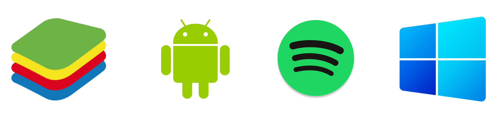
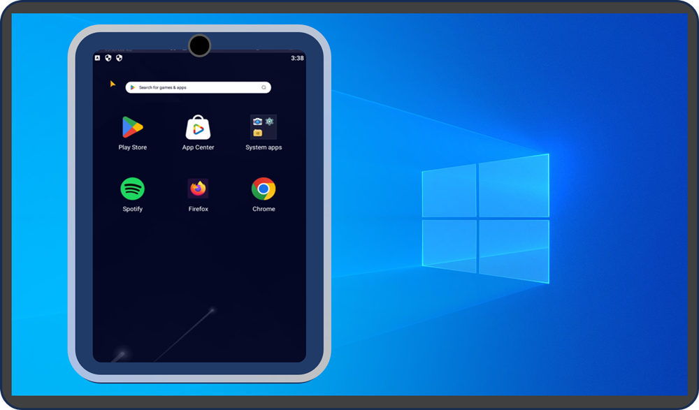
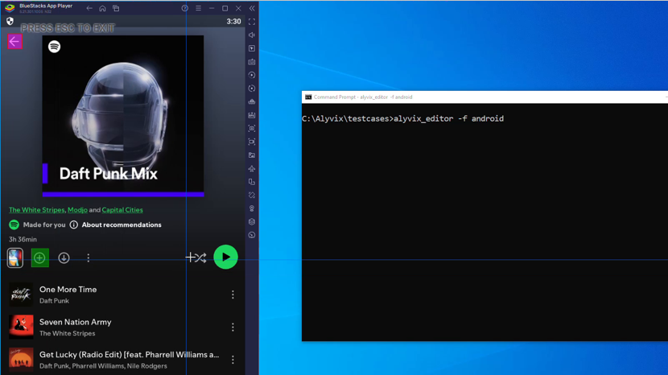
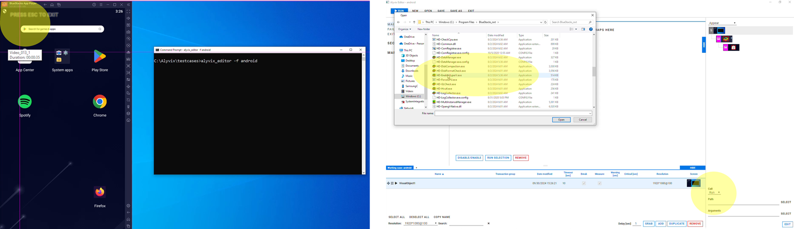
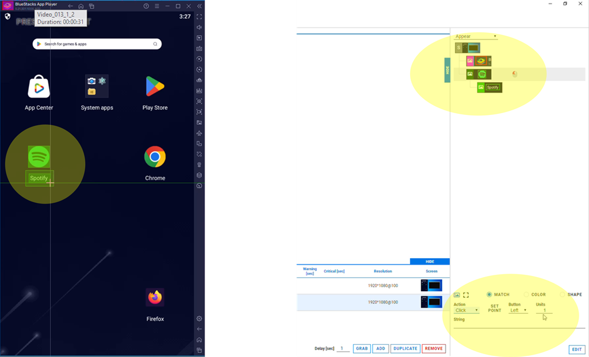
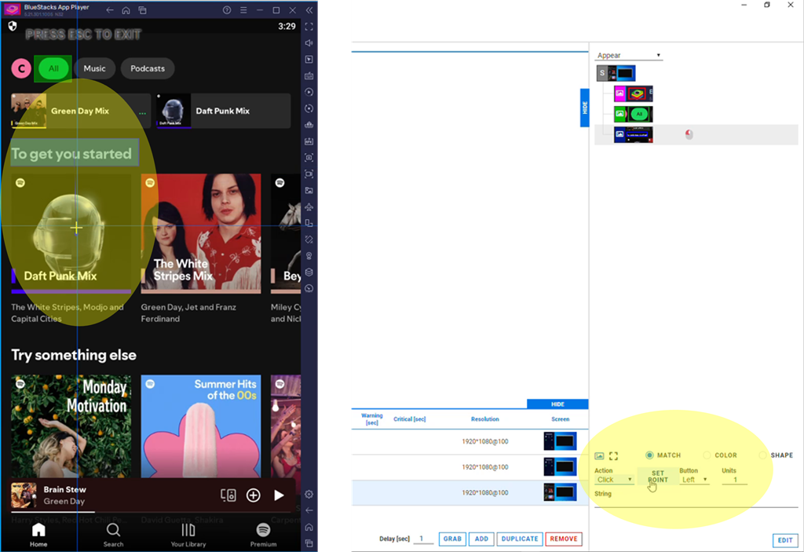
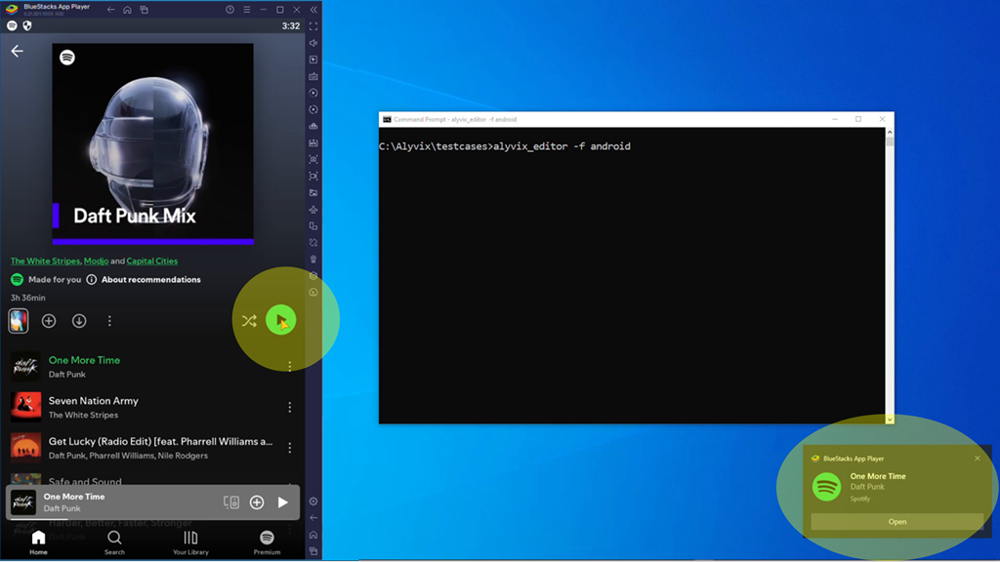
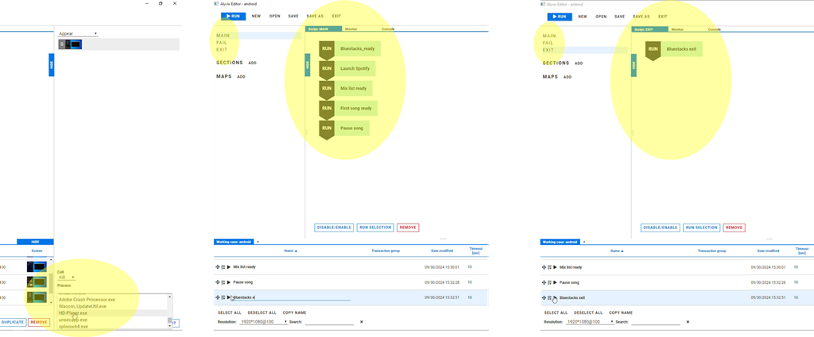
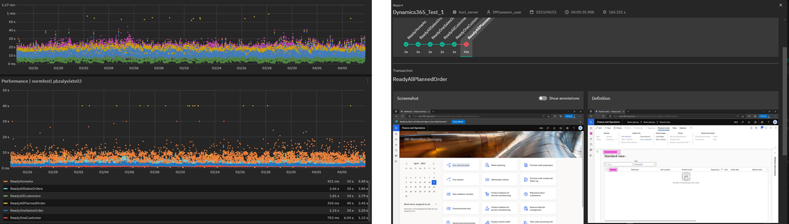

Monitoring apps on mobile devices is hard, because unlike server monitoring, you can't install your own agent.  Without internal access you're pretty much stuck.  Unless of course, you use a different kind of monitoring. A visual synthetic monitoring system like Alyvix can monitor Windows applications just by having access to the GUI, no code needed.

But Alyvix doesn't run on mobile OS's, so how can we get it to work?  We use an Android or iOS emulator, and run Alyvix on the emulator's Windows GUI! Read on to see how we used the Bluestacks Android emulator to run apps from Google's Play Store, and built a test case to monitor an app we don't have any special access to:  Spotify.


===

<!--BLOG ARTICLE-->

# Monitoring Third Party Apps on Mobile Devices

Have you ever tried to monitor applications on a mobile device?  I don't mean monitoring apps you created yourself, I'm talking about completely third party native apps like Microsoft Outlook, mobile streaming apps like Citrix Workspace, or simply 3rd party webapps.  They may not even be yours, but used by your clients through you.

Mobile monitoring is hard because unless you root the device you can't install a generic monitoring agent like you would on a server.

That means you'll need some other way, like having a rooted device, API access to a mobile browser for webapps, a proxy server to intercept HTTP requests or inject JavaScript, or actually have the source code for a native app in your possession.

These four approaches have a lot of disadvantages though, if... they're even possible.  Good luck getting the source for Microsoft Teams on Android, for example.


## Crafting a Solution

What we need is a no-code, non-invasive approach that works even without access to an API, or intercepting network packets: an approach based instead on visual synthetic monitoring where all you need is what you can see on the device's screen.  And since no special knowledge is involved, anyone who can use a computer should be able to easily do it.

Alyvix is exactly that type of solution. While Alyvix runs on Windows, with the use of a Windows-based emulator for Android or iOS, you can monitor any mobile application that runs on the emulator.

Below I'll show you how to use [Alyvix](https://alyvix.com) with the [Bluestacks emulator](https://www.bluestacks.com/) for Android to monitor a native Android app that I definitely don't have the source code for:  Spotify.

I'll show you how Alyvix's no-code, GUI-based approach lets you build and run your first mobile native application check in just a few minutes.



### The Bluestacks Android Emulator and Alyvix

Bluestacks is a free emulator that lets you interact with your Android apps, the Android Desktop, and the notification system.

It's easy to install, and once you've done that, you can download and launch any app you want from the emulator's Desktop using the standard Play Store.

But what's most important for us is that it works on Windows, so we can use Alyvix to recognize interface elements like images and buttons, and click on them just like a user would.



Alyvix operates on Windows applications, and because Bluestacks emulates an Android device on Windows, Alyvix can recognize and interact with Android apps through Bluestacks' own interface.

So you can make screen grabs in the usual way, build test case steps in the same way, and script and run them in the same way.



So are you ready to monitor a native Android app?  Let's build a test case!


## Building the Test Case

A *test case* is a sequence of steps, each consisting of both a recognition and action part, that mimics a user's workflow in specific app.  When it's run in a way that each step is timed, it can be used as a *monitoring check* to measure how long that workflow takes at a specific time.

A monitoring check is a script or program (not necessarily a test case) which is *scheduled* by a monitoring system so that it runs repeatedly at regular intervals on a remote machine, returning the results and using them either to notify a system administrator that they need to take action to fix a problem, or to gather data to be used later for business intelligence.

To build an example test case let's think about a "workflow" for an app most people know about:  Spotify.  We can install Spotify on our Bluestacks emulator using its Google Play Store, and run a very simple workflow like:  (1) launch Bluestacks and Spotify, (2) select a song, (3) play the song, (4) pause the song, and (5) exit Bluestacks and Spotify.

We'll start with the Bluestacks Android emulator already open (left side) and a command prompt (right side) which we can use to launch Alyvix Editor, which helps us create the task steps we need for our test case.

```
> alyvix_editor -f android
```

### Building and the Step Cycle

Before we create our very first test case step, let's look at what those steps are like in general.

User applications work by showing the user the GUI, waiting for user interaction, acting on the user input, updating the GUI, and then waiting for the next user input.  A test case mirrors this interaction.

Within Alyvix, there's a specific sequence of steps we have to carry out for each step:

* *Screen grab:* Create a copy of the screen so we can show Alyvix what's important in the interface
* *Annotation:* Draw rectangles around things that have to be either recognized, or interacted with
* *Actions:* If an interaction, exactly what to do (type, double mouse click, scroll, etc.)
* *Name:* Assign a unique name for the annotations and actions of this step to be used in the script
* *Script:* Freely order, reorder, and reuse the steps we've created and named
* *Run:* Execute the test case using the current Windows desktop, to be sure it works as expected

Alyvix Editor saves all of these steps together in a single file, which can be run once, or be run thousands of times, by *Alyvix Robot*, the test case executor.

With that out of the way, let's use Alyvix Editor to build the steps for our Spotify workflow, where each step follows the sequence above.

### Individual Steps

Our **first** step is to show Alyvix how it can verify that the emulator has launched and is ready to be used.  Best practice when a step needs to launch an application on Windows is to launch it yourself before you begin.  That's because you can combine the launch and the verification of the launch into a single step.

So after you've launched both Bluestacks and Alyvix Editor, annotate some icons that would only be there if Bluestacks actually launched correctly, and then select the executable path to Bluestacks as shown here:



When Alyvix runs this step, it will first launch Bluestacks, and then look for the icons on the emulator screen to be sure it appeared.

For the **second** step we can now assume that the emulator is up, and since we already installed Spotify from the Play Store and put its icon on the main desktop, all we have to do is find the Spotify icon and click on it to launch the app. 

Showing Alyvix how to find the icon is easy, we can just left click and drag to draw a rectangle around it, or right click to autocontour it.  In either case, the selected area will appear in the list of selected areas at the top right of Alyvix Editor.  So we can just select it there, then go down and select the "Click" action out of the list of possible mouse actions at the bottom.



In the **third** step we want to be sure Spotify has launched and, if so, let's then select the first playlist (mix) found under the title "To get you started".

But to choose the first mix in the list we can't just select whatever image is there, because it will likely change from day to day.

Instead we locate something that will always be nearby, like the words "To get you started", and tell Alyvix to click below that with the "Set Point" button.



At this point we've finished the setup of our Spotify check, so for our **fourth** step we're ready to press the big green play button and start listening to music.

As before we show Alyvix which icon to look for, and to click on it to start the first song in the playlist.  Although Alyvix doesn't hear that the audio has started, Windows provides us with a nice notification at the bottom right of the screen as confirmation.

It's an opportune moment to note that a click on Spotify by Alyvix is the same as a click by a person. It doesn't have to be a button that does some internal processing step; if the button affects the outside world, Alyvix can do that too. 



Our **fifth** main step is to pause the song we just started playing.  Since Spotify just replaces the play icon with the pause icon, this step is basically identical to the last one.

Finally we're ready for the **sixth** and last step, which will make sure that we exit the emulator, so that our check leaves everything exactly as we found it.  Exiting is important when monitoring because the same test case may run once every 5 minutes.  It wouldn't be good if after a full day of checks we  had hundreds of emulator instances open.

I mentioned the fifth step was a Main step, but didn't say that about the sixth step.  That's because this last step doesn't go in the Main script like the previous steps do, but in the Exit script. The reason is that we need to run this step no matter what.

You see, the script behavior is to stop when Alyvix sees unexpected behavior.  There's no sense in proceeding all the way to the end if you can't even log in, or if a query never returns.



In fact there are two "extra" scripts:  **Fail** and **Exit**.  If a step in the main script fails, then the rest of the steps in the main script will be skipped, and the Fail script will run.  When either the Main script or Fail script finishes, then the Exit script will always run at the end.

This allows you to include error handling, such as logging out, reverting settings changes, or even killing an application.


## Reports, Graphs, Etc.

We've finished building the test case, so we can now run it by hand with Alyvix Robot as many times as we like, to see when the Spotify app is working on an ad-hoc basis.

We can also use Alyvix Service together with a monitoring system to record the results of repeatedly scheduled runs.  That recorded data can then be viewed and interacted with in graphs, and you can see reports with recorded screenshots comparing the expected screen compared to what happens if something went wrong.



Together these are powerful tools allowing you to begin mitigation in the case of 3rd party apps or hardware, and debugging and correction if they're your own.


## Conclusion

So if you haven't been able to monitor the availability and responsiveness of native apps on mobile devices running Android or iOS, try Alyvix with an emulator.

With its visual, no-code approach, you can monitor any 3rd party app even if you don't have access to its code base, even encrypted streaming apps like Citrix Desktop. And you'll never again have to interpret a browser trace, or intercept packets by setting up a proxy server.


<iframe width="288" height="162" src="https://www.youtube.com/embed/E9pJbtWujSM?color=white&rel=0" frameborder="0" allow="accelerometer; autoplay; encrypted-media; gyroscope; picture-in-picture" allowfullscreen></iframe>
