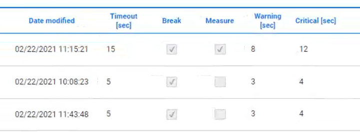
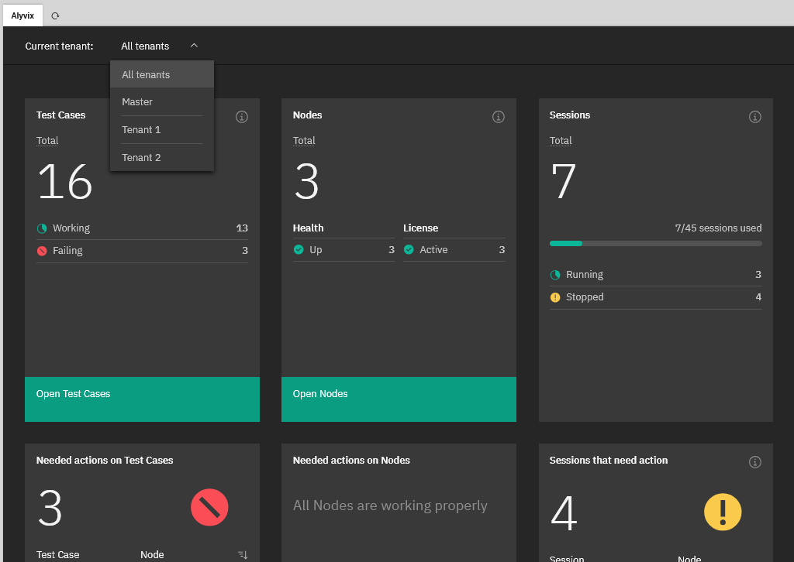
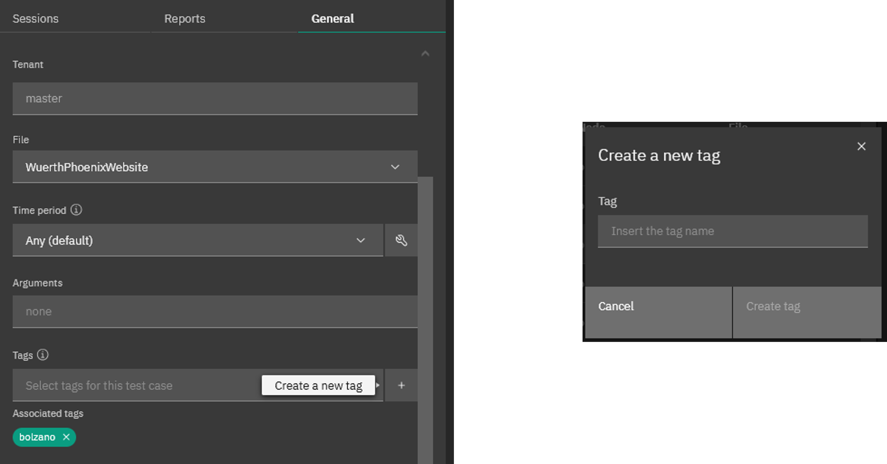
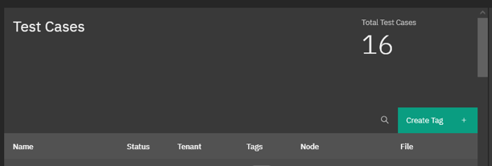
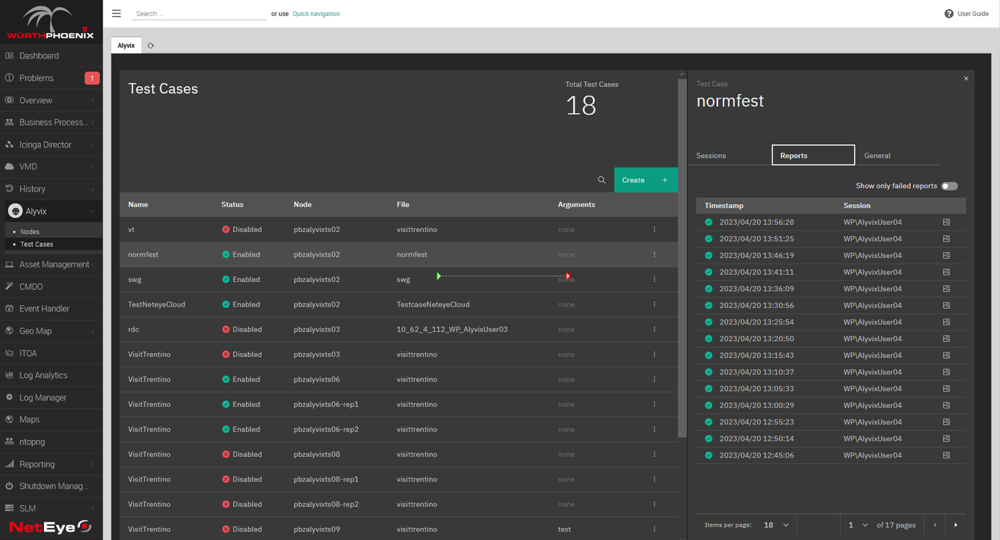
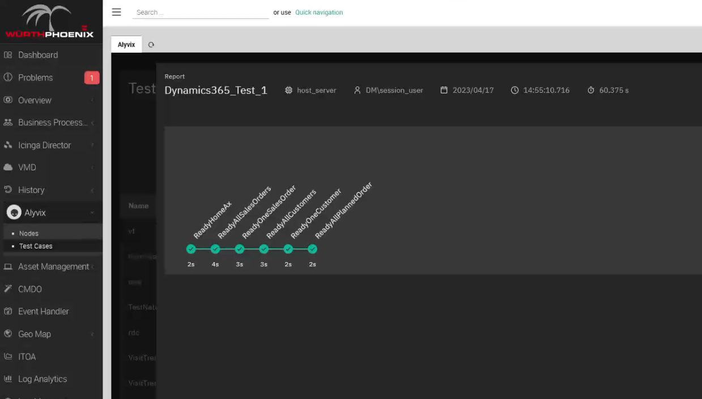
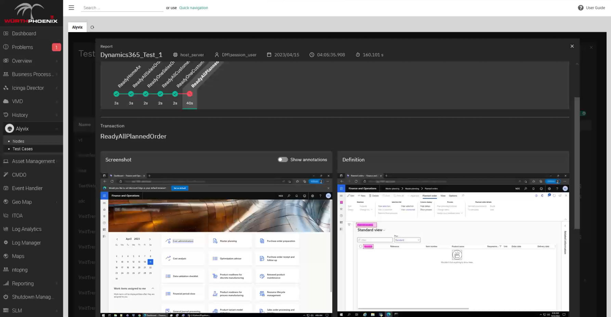
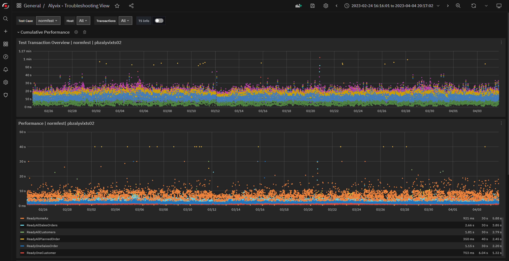
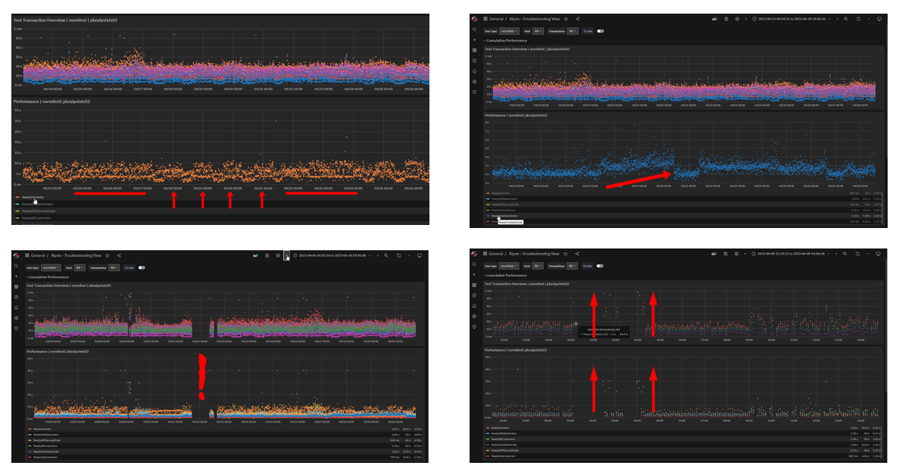

<!--BLOG ABSTRACT-->

Synthetic monitoring nicely complements traditional monitoring.  In today's X-as-a-Service IT world your apps and services are always running somewhere else. Your hosting service probably uses traditional monitoring on their servers, but is it checking that your apps and services are actually working the way your users and customers expect them to?  Alyvix Service works with Alyvix to monitor your apps and services, alerting you if they go down, and giving you the information you need to fix problems.  The latest features in Alyvix Service enable multitenancy and significant scaling that brings synthetic monitoring to hosting services.

===

<!--BLOG ARTICLE-->

## Monitoring

If you're reading this I probably don't have to tell you what **monitoring** is.

It's how we keep our systems up and running *all the time* without needing a small army of people spending their whole day hand-checking that computers and network devices are working.  You're used to automation where checks are scheduled and alerts sent out so you can know immediately when your devices run into problems.

But all that's just true for the hardware.  What if your hardware's doing fine, but your apps or services still aren't working?  How is CPU load going to tell you whether one of your apps like Microsoft's Dynamics 365 is displaying your existing orders, but won't let users add new ones?

## Synthetic Monitoring

That's what **synthetic monitoring** is for.  A visual synthetic monitoring system like Alyvix runs its checks against an application's graphical user interface instead of checking the system's hardware readings.  If a critical application that your users or customers need isn't working, Alyvix tells you right away even if the hardware is running fine.  And what's better is it can even tell you proactively that something is down, you don't have to wait until a user reports that there's a problem.

You see, synthetic monitoring doesn't repeatedly ask your hardware how it's doing like regular monitoring does.  Instead, you create what's called a **bot**, which runs through an application task just like your users would.  As it runs it records how long each step of the task took, and checks if it exceeds the **timeout limit** you set for that step.  At the same time if it exceeds your warning threshold you can log it for later analysis, while if it exceeds your critical threshold it can immediately alert a system administrator to fix or restart the application.

## Alyvix and Alyvix Service

Alyvix Core works together with Alyvix Service to create a complete visual monitoring solution, they are really complementary.  Use **Alyvix Core** to create bots that can later run through individual tasks that your users carry out most often and that have the most importance.  And you can use it to run those bots one at a time by hand.  Alyvix Core is open source and free to use.

But remember that Alyvix Core by itself is not a complete monitoring system.  Ideally you'll want to run a bot to check a task every 2 minutes, 3 minutes, 5 minutes, etc., whatever interval you think is right for that task.  You really wouldn't want to do that all day long by hand, or even have your employees or interns do that by hand.

And that's where Alyvix Service comes in. With Alyvix Service you can set your own schedule for your Alyvix bot, and set different schedules for different bots.  Service is also the interface to your monitoring system.  It takes care of storing and sending the data gathered during each running check and giving it to your monitoring system so that it can generate reports and let you interactively view the data with a visualization system like Grafana.

## Building Your Bot

The first step in the whole process is to build a bot (which we usually call a *test case*).  You'll need to break down your critical task into a series of steps, where the idea is that if your bot can do each step at a particular time, then your users will also be able to do that same task at that time.  Alternately, if the bot can't do a particular step (say, the DB is thrashing), your users will get hung up at the same point.  And that's because of course, it's the exact same interface on the exact same machine, doing the same tasks that users do.

If your app is Microsoft's Dynamics 365 then the steps for one of your critical tasks might be logging in, finding an account, adding a new purchase order, and logging out.  If your app check needs more steps, just add them.  When building your bot, you use the free **Alyvix Editor** (part of Alyvix Core) to define each step:  show it which graphical elements to look for, what buttons or text fields to click on, and what text to type in.  In addition to step scripting, it also has support for loops, login credentials and text recognition.

Alyvix Editor is like a GUI for your GUI, where you can create or edit a screenshot for each task step, and mark it up with your mouse.  When the bot runs later, it compares what it sees on the computer screen at that moment against your marked-up screenshot for that task step you made when you created the bot.  That's why we call it **Visual** synthetic monitoring:  Alyvix "looks" at the screen to make sure your app has the right visual elements in the right places, which is exactly what people do.  If Alyvix is supposed to see a text field at a particular place and it does in fact find it, it will then insert the text string you specified into that text field.

If not....  well then, that's where monitoring comes in, because something went wrong.  So for each task step you also need to give Alyvix a *timeout* threshold: what's the longest time a step should take before we give up completely.  We also give it *warning* and *critical* values as in the screenshot below that the monitoring system can convert into alerts.  For instance, if the login step takes more than 10 seconds, you can configure an automatic alert to your IT admin.

Once you've built your bot, check it once by hand with **Alyvix Robot** (Editor helps you build test cases, Robot runs them) to be sure it works.  Before you put the check into production, you can watch it run your steps live on the actual software interface (Alyvix Service also uses Alyvix Robot when it schedules checks).

## Test Case Configuration

Now we're getting into the connection with monitoring (i.e., the "fun part" for IT admins).  Alyvix Service is this connection.  Once it's been integrated with your existing monitoring system, it schedules your various test cases to run with Alyvix Robot, automatically collecting the results, storing them, and passing them along to your monitoring system.  At that point it can send out immediate alerts, or you can ask it to display reports (current or past) of any given test case, or use its dashboards and interactive data visualization displays.

Here's a quick summary of basic installation and configuration:

* [Install Alyvix Core and Alyvix Service](https://alyvix.com/learn/getting_started/install.html) on the target machine
  * Create a test directory on the target machine
  * Create a working test case and put it in the directory
    * Be sure your test case has *at least one* measure value set with warning and critical values
* Configure Alyvix Service within your monitoring system
  * Consult your monitoring system documentation on how to configure multitenancy
  * Set up an Alyvix **Node** and configure a **Session** on it
  * Tell Service where your test case directory is
  * Assign your test case from above to the Session
  * Set how often the test case should run (scheduling) and enable it

Note that you can configure multiple **Sessions** on a node, and multiple test cases in a Session.

Then all that's left is to wait while Alyvix Service schedules our bot / test case.  While you wait you can drink some coffee, read up on your retirement benefits, or even do a quick workout at your desk.  I suggest reading up on some of the new features in the just-released Alyvix Service version 2.6.

## New Features for Hosting

Version 2.6 of Alyvix Service brings new features that are specifically intended for facilitating the management of large numbers of test cases, which often occurs for instance in hosting environments

### Multitenancy

Multitenancy lets you fully separate groups of Nodes/Sessions (and thus their test cases) from each other.  The idea is that each customer is its own "tenant" within your infrastructure.  Just as in an apartment  building you don't want someone living in one apartment to be able to walk into someone else's, one monitoring tenant should only have View/Edit access to their own data and configurations, nobody else's.  (A full administrator working for the hosting service has access to everything.)

When a customer is given their credentials and logs in, the interface they see looks as if the entire system is theirs and theirs alone.  An administrator instead also sees a list of all the tenants in the system, and can choose a particular one to edit configurations or resolve problems.  When done, he can switch to a different tenant without ever leaving the monitoring system interface.

Multitenancy is highly cost effective for large numbers of clients because it allows them access to their part of the system, uses a single unified interface, and enables installation, updates, maintenance, onboarding, etc. on a single system rather than repeating all that on as many servers as you have clients.

### Tags

Since the early days of the web we've known that it's impossible to keep track of every web page, what's on it, and when it's updated, which is why we have Google, Bing, Duck Duck Go, and so on.  The same can be true for very large clients who have large numbers of test cases running with Alyvix.  The sheer size can make it difficult to locate the right test case, your typical needle-in-a-haystack situation.

Alyvix Service's solution is to allow multiple user-defined tags to be dynamically defined and then assigned arbitrarily to any test case as long as it respects tenancy.  One client may prefer to make a tag for each department like "logistics" and "sales".  Another may prefer to assign test cases by name to the operator who manages them.  A third may like both systems at the same time, which Alyvix Service lets you do by just adding more than one tag to a test case.

### Filtering on Tags

Once you've tagged your test cases, it's easy to filter based on those tags.  Just type in the name of a tag into the filter (next to the magnifying glass shown here) to restrict the table to just the list of test cases that match the tag.

## Reports

So anyway, by now you must be done with your coffee or your quick workout. Where were we.... Oh yes, talking about viewing the results.  The two main visualization options you'll see in monitoring systems are Reports (online or easily-printed PDF format) and Graphs. Let's look at reports first.

Out of all the things a report can tell us, the most important is:  was the bot able to run the test case to completion successfully?  Reports will typically show you a green check for when that's true, and a red X otherwise.  The NetEye monitoring system we used to make both the accompanying video (link at the bottom) and these screenshots is no exception:

So what else can a report tell us?  Well, you can think of a report as a snapshot in time of how a single test case ran.  In the example above we can immediately see not just that the task progressed all the way to the end without stopping, but also how "well" each individual step in our test case worked (i.e., how long it took).

If you remember when we built our bot above, for each individual task step we set a time limit (threshold) to abandon the task if the limit is exceeded.  We also set warning and critical thresholds that will be reported, but allow the test case to proceed.

This data is immediately sent to the monitoring system so that alerts and notifications can be sent.  But Alyvix Service also records a screenshot for each step, and they are associated with the corresponding step and saved as part of the report.

Of course, we're mainly interested in what happens when one of the steps didn't work.  In this case the report shows you those steps that exceeded their time limit (threshold, warning or critical), and the report will now show you both the actual screenshot as above, side by side with what Alyvix expected to see, which is the original screen grab you used when building the test case.

Of course it's a very useful tool for you if you need to diagnose something, because it shows you what the user would have seen at that moment, but it's also proof you can use if for instance you have an SLA where your service is managed by someone else, and you need to show the hosting service that in fact the application wasn't working, exactly when and for how long.

## Interactive Graphs

When you configure a test case, one of the settings is to tell Alyvix Service how often to run it as a check, say for example, every 5 minutes.  That means after an hour we'll have run 12 checks, and after a week you'll have over 2,000 data points for each task step.

By visualizing that data you can begin for example to investigate the details of a slowed step or a failure that happened sometime yesterday.  You'll have a baseline from the weeks or months before the outage to compare against, and critically, knowing the specific step or steps that were significantly slower can help tell you if the app slowdown was due to a lagging database or waiting for processor time.

You might also want to explore to see what the trends are, to help you for instance adjust your system to meet future resource demands.  With the test case run data collected over time you can start digging into the analytics and see what's been slowing down progressively, sometimes so slowly you don't notice it day by day.  Alyvix Service takes care of sending all that data to your monitoring system.

If your monitoring system includes a data visualization interface like Grafana, you can interactively drill down into the graphs.  If you've never scrolled through and selected subranges of graphs by time to drill down on the data, it almost feels like magic the first time you try it.  Just to take a few examples, you can see:

* When response times are worst, like time of day or day of week
* When something is getting progressively slower
* When everything went down
* Which individual task steps took longer than they usually do

Alyvix Service can quantitatively corroborate what your users have been experiencing (like really slow logins or database queries with no results) with more traditional monitoring measures like CPU load and network throughput.  By comparing the two streams of data, you can more quickly find the root cause of these degraded experiences.

## Go Wild

Now that you know what Synthetic Monitoring and Alyvix with Alyvix Service can do for you, try [building a single test case with Alyvix](https://alyvix.com/learn/getting_started.html).  Also check out some of the [many examples of specific applications](https://alyvix.com/learn/videos_and_tutorials/production_systems_tutorials.html#production-systems-tutorials-top) that you can monitor with Alyvix.

And finally, be sure to check out our YouTube channel which has the video version of this article, as well as a number of other videos that can help you learn how to use Alyvix and Alyvix Service.

<iframe width="288" height="162" src="https://www.youtube.com/embed/pWVGW4Aj1c0?color=white&rel=0" frameborder="0" allow="accelerometer; autoplay; encrypted-media; gyroscope; picture-in-picture" allowfullscreen></iframe>
